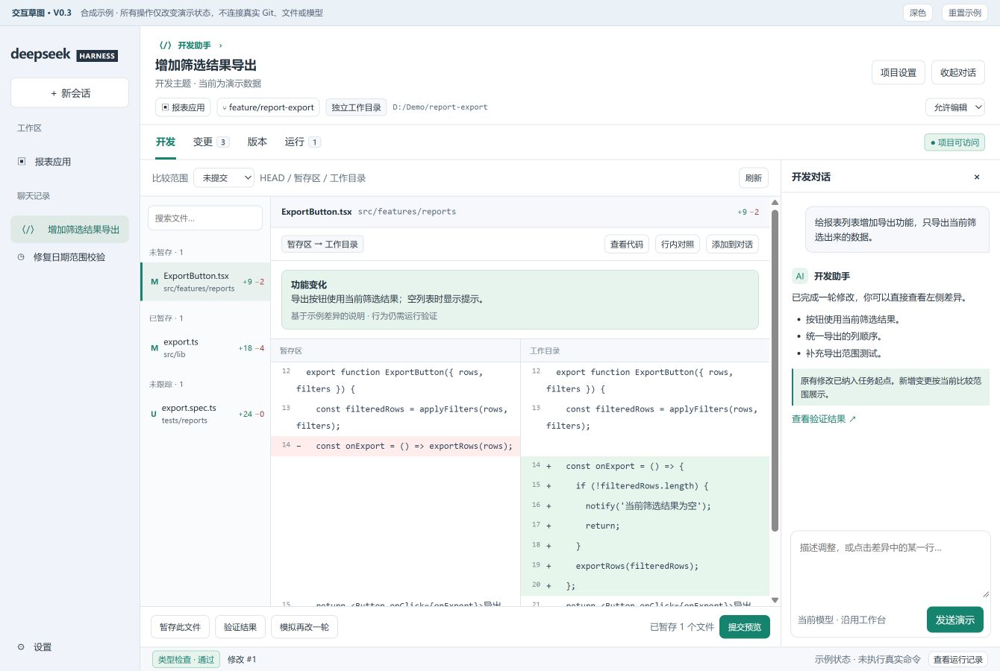

# A018 开发助手方案与第一版实施记录

> 协作迁移说明（2026-10-10）：本文件保留历次方案与执行记录；当前状态以[事项台账](../../PEFR_PLAN.MD)及本文件最新记录为准。旧版本界面、发布流程和本机路径不自动成为现行要求。`<WORKBENCH_ROOT>` 表示克隆后的工作台根目录，`<SECONDARY_WORKSPACE>` 表示作者本机隔离验证目录，后者不是协作开发前提。


> 用户已授权实装。第一版已安装到正式工作台，正常退出并重启后加载；第 19 节记录首版实施，第 20 节记录后台实测与 local.13 修复。第 1–18 节保留 V0.3 设计，原交互草图仍是模拟示例，不能替代实际应用验收。

- 编号：A018；创建：2026-09-29；更新：2026-09-30。
- 记录来源：延续既有方案，按用户要求补充具体功能与 UI 设计。
- 状态：第一版已实施并安装；等待用户正常重启后体验，后续增强另行讨论。
- 阅读：[可点击界面草图](A018-开发助手交互草图.html)；返回：[事项台账](../../PEFR_PLAN.MD)。

## 1. 设计结论与导航结构

开发助手采用四个主选项卡：**开发、变更、版本、运行**。开发页默认打开，代码和对话并排。用户可以随时查看变更、整理提交、比较版本或运行检查，页面切换不要求完成上一阶段。

| 主选项卡 | 用户在这里做什么 | 内部导航 | 切换后的保留行为 |
| --- | --- | --- | --- |
| 开发 | 读代码、提出修改、看助手执行、围绕文件讨论 | 文件树/变更列表；打开的文件标签 | 保留选中文件、代码位置、对话及输入 |
| 变更 | 审阅差异、切换比较范围、暂存与提交 | 本轮变更、任务累计、未提交、分支比较 | 保留每个范围的所选文件和滚动位置 |
| 版本 | 看提交记录、管理分支与工作目录、比较检查点 | 提交记录、分支与目录、检查点 | 保留筛选、所选版本和比较对象 |
| 运行 | 执行检查、看输出、定位失败与追溯操作 | 验证记录、终端输出、操作轨迹 | 运行继续，输出和筛选保留 |

对话是可收起的共享侧栏，四个主选项卡共用同一段对话与输入草稿。运行结果可从底部摘要进入“运行”页，不维护第二份验证状态。项目设置放在标题栏；能力管理仍走能力中心的统一页面。

## 2. 已有实现与需要新增的部分

本节来自此前与本轮的正式源码静态核对，不代表本轮重跑了功能。

| 现有基础 | 复用方式 | 本轮方案要求补充 |
| --- | --- | --- |
| 开发岗位、绿色外观、岗位选择与历史对话 | 保留既有入口和外观 | 专用开发视图与真实执行动作；默认岗位目前没有开发工具绑定 |
| Git 分支、状态统计、提交历史图 | 共享 Git 服务与基础组件 | 文件级状态、逐行差异、提交详情、暂存/提交接口 |
| Worktree 服务、工作区登记与新会话 | 复用创建/列举及路径检查 | 任务关联、目录占用提示、历史接续 |
| Git 事件通道 | 扩展现有通道 | 当前约 30 秒轮询的去重键未覆盖普通文件内容变化，需新增变更版本和文件刷新 |
| 需求助手页签、草稿、服务端历史与轨迹机制 | 提取可复用的导航、状态和任务记录机制 | 开发专用数据类型和代码视图，不复用需求条目字段存放代码 |
| 能力中心与组件编辑 | 共用卡片、五页详情、组件列表、三栏编辑器 | 登记实际开发动作和适配器，前后端共同校验 |

重点源码位置：dsh-git-graph 的 host/git-service.ts、host/routes.ts、host/agent-tool.ts、client/index.ts；dsh-capabilities 的默认岗位、预设与能力模型；dsh-client-ui-plain-chat 的 RequirementsAssistant、历史与页面挂载逻辑。

## 3. 整体布局与视觉示意

工作台左侧历史栏、顶部岗位入口及其既有颜色和图标保持。下表描述开发主内容区。

| 区域 | 建议尺寸 | 内容 | 收起后 |
| --- | --- | --- | --- |
| 任务标题行 | 48—56 px 高 | 开发主题、保存状态、项目设置、显示/隐藏对话 | 始终保留 |
| 项目上下文行 | 36—44 px 高，可换行 | 项目、分支、工作目录、当前工作权限 | 长路径省略，点击查看完整路径 |
| 主选项卡行 | 40—44 px 高 | 开发、变更、版本、运行；必要时显示数量 | 始终保留，窄屏可滚动 |
| 文件与变更栏 | 初始约 200 px，范围 180—280 px | 文件搜索、文件树或分组变更列表 | 留“文件”入口，以抽屉恢复 |
| 代码主区 | 占剩余宽度，双栏时最小约 420 px | 文件标签、路径、比较工具栏、代码或差异 | 可切为全宽阅读 |
| 对话栏 | 初始约 330 px，范围 300—440 px | 消息、执行卡、上下文标记和输入 | 留对话按钮，提示新结果数量 |
| 底部运行摘要 | 初始收起，展开约 180—260 px | 当前执行、最新检查摘要、短输出 | 一行显示运行或失败状态 |

界面示意图位于下方，可点击阅读版中的交互草图链接查看四个主页面。图中的项目、文件和结果均为设计示例。



宽屏优先“文件—代码—对话”三列。尺寸以内容区可用宽度判断，避免把工作台侧栏占用也算入三列空间。所有收起操作保留数据和执行状态。

## 4. 首次进入、项目与任务绑定

| 场景 | 页面呈现 | 用户操作与结果 |
| --- | --- | --- |
| 未绑定项目 | 中间显示“选择本地项目”；对话可进行一般讨论 | 选择已有登记项目或添加目录，显示实际路径与仓库检测结果 |
| 普通文件夹 | 文件可浏览，Git 区显示“尚未初始化” | 主动点击“初始化 Git”后展示目录与忽略项建议，确认后再创建仓库 |
| 已有 Git 仓库 | 显示当前分支、HEAD、原有修改/暂存数量 | 可直接开始；记录任务起点，原有修改保持原状 |
| 选择独立目录 | 弹出基于哪个提交、目录名称及已有可复用目录 | 创建或选择后展示实际执行目录；不自动复制原目录的未提交修改 |
| 只打开页面 | 展示临时会话与选择状态 | 只浏览/选页不调用模型、不生成 Git 提交、不新增空业务任务 |
| 首次发送或执行 | 持久化任务并固定起点 | 使用幂等请求避免重复任务，失败保留输入与选择 |
| 历史任务重开 | 恢复目录、页签、选中文件、输入与结果 | 检测当前仓库状态；目录缺失显示重新定位入口，保留旧记录 |

执行会话 cwd 在现有宿主中固定。已有执行会话改用另一目录，应创建关联执行会话并记录来源；旧记录保留，页面明确显示新的实际目录，不能只修改前端标签。

## 5. 顶部通用控件

| 控件 | 点击后 | 运行中与异常规则 |
| --- | --- | --- |
| 任务名称 | 原位编辑，保存为开发主题名称 | 不改变分支或目录 |
| 项目名称 | 查看项目位置、规则文件、技术栈与关联来源 | 更换项目建立新的关联任务，保留原任务 |
| 分支标签 | 打开分支列表；可看差异、创建分支、切换分支 | 查看无副作用；切换前检查目录占用、冲突与未完成 Git 操作 |
| 工作目录标签 | 展示主目录/独立目录、路径、使用它的任务 | 运行中不能悄悄迁移路径 |
| 只读讨论/允许编辑 | 显示当前任务允许的操作范围 | 编辑授权不自动包含提交、推送或部署；运行期间收回权限需停止相应执行 |
| 项目设置 | 打开项目级设置抽屉 | 标明设置作用范围，取消保留原设置 |
| 对话按钮 | 收起/恢复右侧对话 | 消息和输入保持，隐藏时显示新结果数量 |

模型入口放在对话输入区，复用现有模型选择。自动检查、外部编辑器、运行命令配置放在项目设置，不占用主选项卡。

## 6. 开发页：代码与对话共同工作

### 文件栏

顶部提供“文件 / 变更”切换与搜索。文件树搜索按路径过滤；内容搜索单独触发并显示匹配行。点击文件在中间打开，重复点击复用标签；关闭文件不删除文件、不丢弃任务。

变更列表复用“变更”页的数据与状态，点击“查看全部变更”切换主选项卡并保留所选文件。列表显示新增/修改/删除/重命名、增删行数、暂存状态；同一文件同时已暂存和未暂存时分开说明。

### 代码区与工具栏

| 入口 | 行为 |
| --- | --- |
| 文件标签 | 打开多个文件，切换保留各自滚动；未保存内容在后续内嵌编辑版本中单独标识 |
| 查看代码/查看差异 | 同一文件两种阅读方式，明确当前比较基准 |
| 左右/行内 | 切换差异展示，保持当前修改位置 |
| 上一处/下一处 | 跳转同文件修改块，越界时停在首尾并显示数量 |
| 添加到对话 | 将文件或选中片段放入输入区的上下文标记，不自动发送 |
| 解释/审查/修改/补测试 | 携带片段和版本进入对话；“修改”预填指令供用户补充 |
| 在编辑器中打开 | 使用已配置编辑器；未配置时引导选择真实入口 |
| 重新读取 | 读取当前文件并刷新差异；过期引用保留原始版本 |

第一版提供可靠的阅读和差异，不承诺内嵌完整 IDE。允许编辑后，助手可在授权任务范围内连续写入，完成一次写入即通知 Git 状态服务。

### 对话与执行卡

输入区显示可移除的“文件/行/版本/需求”标记，用户可恢复到整个任务讨论。消息卡展示实际操作：正在读取、正在修改、已写入、运行检查、等待处理、失败或停止。点击卡片可跳到对应差异、运行记录或文件。

模型运行中仍可编辑输入草稿。第一版下一次发送需等待本轮结束或停止，不把未发送文本悄悄排队。停止后保留已写入变更和日志，明确未执行的剩余部分。

## 7. 变更页：四种范围与提交整理

顶部提供范围选择、基准信息、刷新状态及差异统计。左侧文件列表、中间差异、右侧共享对话；收起对话可扩大审查区域。

| 范围 | 数据与默认展示 | 可用操作 |
| --- | --- | --- |
| 本轮变更 | 最近一轮操作前后快照；可选择具体轮次 | 比较、讨论、审查；准确匹配且无外部编辑时可撤销记录内改动 |
| 任务累计 | 固定任务起点与当前文件状态；包含期间已提交的修改 | 比较、功能说明、关联需求 |
| 未提交 | HEAD/暂存区/工作目录分层；默认打开未暂存组 | 按文件暂存/取消暂存、提交预览、本地提交 |
| 分支比较 | 显示共同起点、目标分支已知版本与当前 HEAD | 比较、选择另一基准、刷新基准；查看不切换分支 |

暂存和提交只操作实际索引。用户在本轮、任务或分支视图点击“整理提交”时跳转到未提交范围，并保留原文件选择；不能拿快照差异直接冒充将提交内容。

### 未提交范围

- 分组为“未暂存”“已暂存”“未跟踪”“冲突”。同文件允许分别出现在已暂存和未暂存组，组内显示准确差异。
- 勾选文件后出现批量操作栏，默认无全选。整文件暂存会包含该文件全部未暂存变化，混合状态明确提示。
- “取消暂存”只改索引，保留工作文件。恢复/丢弃修改使用独立入口及影响预览。
- 未跟踪文件显示新文件内容；二进制显示元信息；超大差异按需加载；忽略项默认排除并可查看排除原因。
- 冲突文件进入明确的冲突说明；第一版允许查看与打开编辑器，解决后重新检测，后续再加入完整三方合并。

## 8. 差异评论、功能说明与刷新

| 场景 | 具体交互 | 数据约束 |
| --- | --- | --- |
| 选中几行 | 出现“解释、审查、修改、补测试”操作条 | 记录文件、左右侧、版本、行号及片段；不是只保存行号 |
| 评论后代码变了 | 原评论显示其版本，可查看原片段 | 能重定位则更新位置；否则提示引用位置已变化 |
| 生成功能说明 | 顶部卡片概括行为变化，每条可跳回差异 | AI 推断与已验证事实分别标明 |
| 助手写入 | 更新文件列表、当前差异和统计 | 基于完成的写入事件，不展示未落盘文本为真实改动 |
| 外部保存 | 合并连续事件后更新，显示外部变化提示 | 归属无法确认时不标成助手修改 |
| 正在阅读旧内容 | 提示“有更新”，可固定当前版本阅读 | 不强制跳动或清空选择 |
| 刷新失败 | 保留原显示并标上次更新时间、重试 | 不能显示为已同步 |

初始建议将连续文件通知合并到约 300—800 ms 的刷新窗口，最终按 Windows 实测调整；读取大差异时显示加载状态。每个仓库共享一个刷新源，按选中文件读取内容，避免每个面板各自高频启动 Git。

## 9. 版本页：提交、分支与检查点

| 子选项卡 | 布局 | 操作与结果 |
| --- | --- | --- |
| 提交记录 | 左侧提交图和筛选；右侧提交说明、文件列表与差异 | 选提交看详情、与上一版本比较、设为比较起点、复制提交标识 |
| 分支与目录 | 上方分支列表；下方各工作目录卡片 | 创建/切换分支、查看比较、选择或创建独立目录、查看占用 |
| 检查点 | 时间列表与名称；右侧相对当前状态的差异 | 新建、命名、比较、恢复预览；显示覆盖和排除范围 |

分支卡显示当前分支、提交位置和正在使用它的目录。工作目录卡显示路径、关联任务、改动数量、运行占用与最近访问；“打开”只导航到它的任务，不自动清理其他目录。

第一版包含基础提交详情、单提交差异、分支比较与检查点查看；任意多版本复杂比较、片段级恢复和历史提交撤销后续扩展。任务检查点不是普通 Git 提交，不写入用户提交历史。

## 10. 提交、创建目录与恢复弹窗

| 弹窗 | 展示与输入 | 主按钮 | 失败/取消后的行为 |
| --- | --- | --- | --- |
| 提交预览 | 当前分支、准确暂存文件与差异、提交说明、验证对应版本 | 提交到当前分支 | 失败保留说明和暂存状态；取消不更改仓库 |
| 创建分支 | 起点、分支名称、创建后是否切换；名称校验 | 创建分支 | 冲突/占用显示原因，旧分支与草稿保留 |
| 独立工作目录 | 可复用目录、起点、名称、目标路径、原目录未提交数量 | 使用所选目录/创建并进入 | 创建失败保留选择；不自动带入未提交修改 |
| 新建检查点 | 名称、覆盖文件数、排除项与范围说明 | 保存检查点 | 保存失败不显示已保存 |
| 恢复检查点 | 将修改/新增/移除的文件、冲突、索引影响 | 恢复选定修改 | 内容不匹配时阻断相关项，其他原有工作保持 |
| 项目设置 | 路径、规则、验证命令、编辑器、自动检查选项 | 保存设置 | 标明项目级或任务级；取消丢弃本表单修改 |
| 移除开发记录 | 会话和业务记录影响，说明代码/提交/目录是否保留 | 移除记录 | 沿用既有省略号菜单；运行中先处理占用 |

第一版取消暂存和提交按文件处理，最终提交以完整索引内容为准；已有暂存项必须全部展示，不能偷偷混入或清除。提交前重新核对 HEAD 和索引版本，失败时不自动重放；执行后查询真实提交结果。

创建分支的起点能力需与既有接口匹配：当前已有接口从 HEAD 创建，新起点选项须扩展后才能开放。执行会话变更目录的接续遵循第 4 节，不伪造同会话 cwd 迁移。

## 11. 运行页：验证、输出和轨迹

| 子选项卡 | 显示内容 | 主要操作 |
| --- | --- | --- |
| 验证记录 | 每次检查的名称、范围、命令、目录、版本、时间、退出状态 | 运行选定检查、停止、重试、查看输出、围绕失败讨论 |
| 终端输出 | 当前或历史进程列表、输出流、终止原因 | 选择进程、搜索输出、复制选中内容、定位报错；不是默认开放的任意命令入口 |
| 操作轨迹 | 真实读取/修改/Git/检查点/验证事件及结果 | 类型筛选、展开详情、跳回文件或提交 |

没有验证命令时，显示从项目配置中找到的候选与“确认命令”入口；不能臆造已存在的脚本。用户明确设置后可用于重复检查。执行中允许查看其他页；停止后保留日志，不能把取消显示成通过。

结果绑定代码状态。代码后来变化，旧“通过”保留为历史结果，当前显示“待复验”。运行期间文件改变则提示验证对象发生变化。工作目录与暂存区不同时，不能将工作目录的通过结果当作暂存内容已验证。

## 12. 状态、空白与错误设计

| 对象 | 状态 | 展示与下一步 |
| --- | --- | --- |
| 项目 | 未选择、读取中、可访问、失效 | 选择/等待/查看路径/重新定位 |
| Git | 未初始化、正常、冲突、操作进行中、不可用 | 初始化入口/正常操作/解决冲突/查看进行中操作/检查环境 |
| 变更 | 无变化、加载中、有变化、过期、读取失败 | 中性空态/加载/文件列表/有更新/保留旧内容并重试 |
| 助手 | 空闲、运行、等待处理、停止中、停止、失败 | 输入/进度/明确原因/等待终止/保留已完成部分/重试 |
| 验证 | 未运行、运行、通过、失败、取消、中断、待复验 | 独立文字与图标；待复验保留上次结果 |
| 保存 | 未保存、保存中、已保存、失败、冲突 | 根据真实响应展示，失败保留本地草稿 |
| 提交 | 无暂存、可提交、提交中、完成、失败/结果待核实 | 检查索引/预览/等待/显示提交标识/重新查询实际状态 |

空白页应说明如何开始，如“当前没有未提交修改”“选择一个文件查看差异”。不显示虚构统计。按钮不可用时给出具体原因与可执行的下一步，不能仅降低透明度。

## 13. 页面联动与数据保留

| 用户动作 | UI 联动 | 持久化或执行行为 |
| --- | --- | --- |
| 切主选项卡 | 内容区切换，对话可保持展开 | 保存页面状态；无模型/Git 写操作 |
| 选择文件或版本 | 展示对应代码和基准 | 读取数据，不修改仓库 |
| 添加片段到对话 | 输入区增加上下文标记 | 保留引用版本，不自动发送 |
| 发出修改要求 | 对话显示执行卡，写入后变更自动更新 | 创建操作记录、保存前后依据、调用受限文件/命令适配器 |
| 暂存/取消暂存 | 文件在组间更新，中间差异同步 | 后端校验索引版本并执行真实 Git 操作 |
| 创建提交 | 未提交数量减少，版本页新增记录 | 任务起点保持，任务累计视图仍可查看总体变化 |
| 代码再次变化 | 旧检查结果标为需复验 | 保留原日志与代码标识 |
| 重开或刷新 | 恢复页签、文件、比较范围和草稿 | 重新检测仓库，不自动恢复执行旧命令 |

业务结果、操作记录、比较基准和检查点由服务端保存。布局偏好存客户端；发送草稿沿用已有自动保存机制。模型响应和后台请求带任务与版本标识，切换任务后迟到结果不能覆盖新页面。一个目录内部修改按序执行，外部改动以复核和冲突反馈处理。

## 14. 视觉、主题与窄屏

沿用工作台字体、背景、边框、圆角、按钮和焦点风格；开发岗位沿用绿色强调色。主选项卡用文字与下划线表达选中，子导航使用较浅背景或紧凑分段控件。绿色新增、红色删除同时显示加减符号与行号，不能只靠颜色。

建议正文 13—14 px，代码 12—13 px，辅助文字不小于 11 px；控件高度约 32—36 px，触控模式扩大点击区域。布局间距采用 8/12/16 px，表格和代码内容可滚动。关键状态置于操作附近，成功提示短暂出现，错误保持到处理或关闭。

| 主内容可用宽度 | 推荐布局 |
| --- | --- |
| 约 1100 px 及以上 | 文件、代码、对话三列；底部运行区可展开 |
| 约 800—1099 px | 代码与对话两列，文件栏改抽屉 |
| 约 560—799 px | 主视图全宽，对话可覆盖打开；差异默认行内 |
| 小于约 560 px | 单栏，保留四主选项卡；文件/差异/对话采用返回式导航 |

键盘用左右箭头切换同组页签、Tab 到控件、Enter 激活、Esc 关闭最内层抽屉并回到触发控件。发送快捷键沿用当前工作台设置，不自行替换。动画只用于区域展开与状态反馈，遵守减少动效偏好。浅深主题都复用主题变量。

## 15. 具体如何实现：前端与服务分工

以下名称为建议的开发模块边界，尚未创建文件或接口。

| 层 | 建议职责 | 复用与新增 |
| --- | --- | --- |
| 开发页面容器 | 项目上下文、主页签、布局与共享对话 | 接入现有岗位/会话挂载，新增开发专用容器 |
| 文件与差异组件 | 文件树、状态分组、差异渲染、片段引用 | 抽成共享组件，开发页和变更页共用 |
| 版本与运行组件 | 历史图、分支/目录、检查点、验证详情 | 复用已有 Git 组件，新增缺失业务视图 |
| 仓库状态服务 | 仓库状态、文件列表、内容版本、订阅刷新 | 扩展 dsh-git-graph；同仓库共享读取与通知 |
| Git 操作服务 | 比较、暂存、取消暂存、提交、分支/worktree | 共享服务提供结构化动作，不拼接模型给出的任意 shell |
| 开发任务服务 | 任务起点、轮次、草稿、引用、检查点、操作记录 | 独立开发数据，沿用任务持久化与幂等惯例 |
| 执行适配器 | 项目读写、命令执行、停止、实际结果回传 | 复用宿主能力，绑定实际目录、角色发布版本和权限 |

核心数据建议包括：开发任务、仓库快照、文件状态、比较请求、文件片段引用、开发操作、验证记录、检查点。仓库标识须区分共同仓库与具体 worktree；比较需要完整提交标识或快照标识，不能只存显示名称。

## 16. 具体如何实现：关键动作

| 功能 | 前端提交什么 | 后端做什么 | 完成后返回什么 |
| --- | --- | --- | --- |
| 读取变更 | 任务、目录、比较范围、当前版本 | 核验目录；按真实 Git 状态读取，按需读取内容 | 文件列表、比较基准、内容版本、限制说明 |
| 读取差异 | 文件标识、左右版本、展示选项 | 获取精确内容，处理重命名/二进制/大小限制 | 差异块、左右行、内容标识 |
| 修改文件 | 已授权任务、目标和预期原内容 | 校验路径/权限/原内容，保存依据后写入 | 写入结果、前后标识、受影响文件 |
| 暂存/取消暂存 | 选定文件、期望 HEAD/索引版本 | 检查冲突与并发变化，执行对应文件操作 | 新索引状态及差异；冲突则不冒充成功 |
| 提交 | 提交说明、用户已看过的索引标识 | 再核对索引、执行提交并查询真实结果 | 提交标识、实际文件范围、剩余未提交项 |
| 验证 | 已配置命令、任务、目录、代码状态 | 启动受管理进程，记录输出/退出，支持停止 | 日志、状态、验证对象与是否已过期 |
| 检查点 | 范围、名称、起点 | 保存覆盖文件与元数据，列明排除项 | 检查点标识和可恢复范围 |
| 恢复 | 选定检查点/文件与当前内容标识 | 预检后仅恢复匹配的记录内修改，报告冲突 | 实际恢复项、新差异和未处理项 |

同目录内部写操作串行化，并在执行前后读取状态。外部编辑器和 Git 仍可能同时操作，单纯进程锁不能完全排除外部竞争；复核发现变化时拒绝使用旧预览并重新展示。通用命令同样受到目录和授权约束。

## 17. 统一能力管理与迁移

开发能力沿用五个详情入口：概览与状态、使用说明、默认配置、关联组件、使用岗位。组件按实际可独立执行的服务定义，覆盖项目文件操作、Git、命令与可选预览；页面页签不等同于插件。

继续支持统一收藏、回收站、紧凑列表、三栏编辑、移除与补回、缺失草稿保存及发布校验。模型、编辑器和验证命令分别有清楚的设置来源与作用范围；凭据保留在已有服务端设置，禁止进入任务快照或版本记录。

新增发布版本保留用户原岗位外观、职责、草稿、历史会话与配置。已经开始的任务继续绑定真实发布版本。旧普通开发聊天可继续查看，进入新开发工作区时明确绑定项目，不将旧对话自动执行为代码修改。

## 18. 分期、验收与演示范围

### 建议第一版

四主选项卡均具备基础行为：开发页并排阅读和对话；变更页四类比较及文件级暂存/本地提交；版本页基础提交详情、分支/worktree 与检查点；运行页真实验证、输出及轨迹。功能说明、片段讨论、任务保存与重开随核心流程接入。

### 后续增强

片段级暂存、跨轮重叠恢复、完整三方合并、内嵌 IDE、前端运行效果预览、远程同步和合并请求。后续功能的入口在可执行前不显示为可用操作。

| 验收场景 | 应观察到的行为 |
| --- | --- |
| 边修改边查看 | 文件数和内容变化都更新，原阅读位置保持 |
| 四范围切换 | 基准明确，任务开始前的修改不冒充本任务贡献 |
| 外部编辑同时发生 | 更新或提示冲突，不覆盖用户新内容 |
| 部分暂存文件 | 已暂存和未暂存分别可见，提交内容准确 |
| 提交成功/失败 | 成功返回真实标识；失败保留说明和正确状态 |
| 修改后重新检查 | 旧通过结果显示待复验，日志仍可查看 |
| 停止/重开 | 保留已写入内容和输出，不自动重放旧命令 |
| worktree 进入 | 页面路径和实际执行 cwd 一致，原工作保留 |
| 检查点恢复 | 显示覆盖范围，后续冲突有明确处理 |
| 共享管理回归 | 组件缺失草稿、发布阻断、补回及已发布执行隔离通过 |
| 页签/窄屏/主题 | 草稿、所选文件与焦点保留，控件可用，无横向溢出 |

### 本轮交付与边界

本轮输出详细方案、离线阅读版、可点击界面草图及示意截图。草图演示主/子页签、文件选择、比较范围、对话上下文、暂存、提交预览、检查点和验证过期等状态，全部使用合成数据；不执行真实 Git、模型或文件修改。

本轮已在浏览器检查：跨页输入保留、检查点保存、文件暂存、提交范围预览、示例提交后任务累计仍保留、代码再次修改后的待复验和运行中状态、代码/差异切换、键盘主页签切换、窄屏文件抽屉与对话、浅深显示。1340 px 和 390 px 宽度未出现页面横向溢出；草图未记录控制台错误。阅读版的章节跳转、当前章节高亮和“提交预览”搜索高亮已检查。以上为方案展示与模拟交互验证，不是应用功能验收。

V0.1/V0.2 原方案保留在二次开发目录，正式 A018 路径保持以免旧链接失效。V0.3 明确四主选项卡和组件职责，细化已有 Git 核心方向。本轮未修改正式应用、运行配置、岗位数据或仓库状态；具体 UI 与第一版实施范围仍待讨论。


## 19. 第一版实装、验证与回退（2026-09-30）

### 19.1 授权和交付

用户明确说“开发助手实装了吗？没实装的话可以执行实装了”，据此实施第 18 节的第一版核心能力。正式能力包为 **0.1.0-local.12**；普通聊天界面与共享 Git 服务同步更新，共 34 个源码/构建增量。没有强制退出或重启用户正在运行的正式宿主。

使用入口：正常退出工作台并重新启动，进入“新会话”，选择“开发助手”，选择或登记本地项目。默认只读；需要让模型修改文件时选择“允许编辑”。测试命令先在“项目设置”确认，再到“运行”页点击执行。

| 页面 | 已接入的实际功能 |
| --- | --- |
| 开发 | 项目文件列表、路径/内容搜索、多文件标签、代码阅读、文件/行/版本上下文；共享模型选择与对话；模型读取后按内容版本写入，支持停止 |
| 变更 | 本轮快照、任务累计、未提交、分支比较；已暂存/未暂存/未跟踪/冲突分组；行内或左右内容对照；按文件暂存、取消暂存、完整暂存区预览和本地提交 |
| 版本 | 提交记录和文件内容、基于共同祖先的分支比较、本地分支创建/切换；已有 worktree 列表、新建独立目录并绑定新任务；检查点保存、比较和受保护恢复 |
| 运行 | 项目已确认命令、实际进程输出、退出码、停止、操作轨迹；记录实际 cwd、HEAD、索引和代码指纹，代码改变后显示需要重新验证 |
| 管理 | 复用统一能力卡片、收藏/回收站、五类详情、紧凑组件列表及三栏组合编辑器；三个必需组件可从草稿移除、补回，缺失草稿可保存，发布前前后端校验 |
| 历史与布局 | 服务端保存任务、模型消息、轮次、运行结果及检查点；侧栏重开；四主页面共用输入；文件抽屉、对话收起、键盘页签和浅深主题 |

### 19.2 数据、Git 与执行保护

- 开发任务绑定登记后的真实项目根目录和已发布岗位版本，任务的 cwd 不会随另一个项目选择静默改变；新 worktree 使用新任务。
- 第一次保存记录原工作区内容，任务累计以此为起点。任务期间的外部修改也可能出现在比较中，界面明确说明归属应查操作轨迹。提交后仍能看任务累计变化。
- 默认只读。模型只使用已适配的读取、搜索、文本写入、移除和结束动作；必须先读取目标，包括新文件。实际写入检查原内容版本，遇到外部变化拒绝覆盖。模型不会自动提交、推送或执行任意 shell。
- 暂存按整个文件执行。提交预览覆盖完整索引，提交前重新核对 HEAD、索引和冲突状态；验证针对工作目录，不能据此把不同的暂存内容当作已验证。
- 同目录的开发/验证有占用保护，停止或结束释放。命令使用本机权限运行，项目设置保存的完整命令就是执行内容。Windows 自动发现 npm/pnpm 脚本时使用 .cmd 入口，保持系统原执行策略。
- 检查点只保存允许范围内的内容。恢复仅处理本任务有写入记录、当前版本匹配且未在索引中改动的文件；冲突项阻断。中途失败保留已完成文件、恢复轮次和失败说明，不静默丢失记录。
- 服务重启把未结束执行标为中断，不重放旧命令。凭据目录、常见密钥文件、生成物、链接等排除；大文件/二进制显示限制。文本编辑单文件上限 256 KB，快照文本总量 24 MB，项目最多 12000 个纳入文件，单轮最多 24 次模型操作。
- 默认开发岗位按一次性迁移接入能力：从原已发布定义生成新版本，保留旧版本及未发布草稿内容，不把草稿字段自动发布；其他岗位、外观与现有配置保持。迁移前备份为 capabilities/state-before-developer-capability-v1.json，正式迁移在正常重启加载新版时执行。

### 19.3 实际验证

| 验证项 | 结果与范围 |
| --- | --- |
| 自动测试 | 能力后端 83 项、聊天界面 140 项、Git 159 项，共 382 项通过 |
| 核心保护 | 覆盖部分暂存、旧预览拒绝、Unicode 路径、重命名原路径排除、原脏工作保留、外部写入冲突、幂等创建/发送、停止、权限撤销、检查点部分恢复记录、迁移与草稿/发布隔离 |
| 编译与依赖 | 三包类型检查、构建和运行导入依赖检查通过；正式安装包可导入，聚合插件真实解析到新版 Git 服务 |
| 真实模型 | 在独立 DSH_HOME 的合成 sample-project 中调用已配置的 DeepSeek-V4-Flash；实际读取并修改 sum.js、sum.test.js，新增 subtract 和对应测试；回读及 Git 差异一致 |
| 真实进程 | 从 UI 保存项目命令并执行 npm.cmd run test，2 项测试通过、退出码 0，终端输出与代码指纹可见；保留先前命令失败记录，没有改系统执行策略 |
| 真实 Git | UI 只暂存 sum.js 后预览恰为 1 个文件；创建本地提交，sum.test.js 仍未暂存。任务累计仍包含两个文件 |
| 真实 worktree | 通过服务创建独立 Git 工作目录并建立持久任务；在新目录运行命令返回其实际 cwd，原目录的未提交工作、索引及 HEAD 保持 |
| 真实接口 | 未认证和跨来源请求拒绝；排除路径拒绝；检查点预览、代码变化导致指纹失配、文件恢复后指纹一致均核对 |
| 统一管理 | 实际 UI 移除 Git 必需组件、保存缺失草稿、重开三栏编辑器、发布阻断、键盘补回、重复添加禁用和保存通过；已发布版本保持 v1。浏览器/会议/需求共享路径由全量测试回归 |
| 页面检查 | 桌面 1280×720、窄屏 760×900 的抽屉与对话收起、浅深主题和历史重开通过；最终浏览器无 error。岗位入口及现有背景/宠物保留 |
| 安装与回退 | 在独立 profile 安装 local.12 并回退实际 local.11；Git 运行包、UI、源码及配置哈希一致；最终正式 34 项增量安装后再次核对 |
| 正式数据 | capabilities/state.json 和 profile cordis.patch.yml 哈希保持；未写入正式开发业务记录；正式宿主保持运行，QA 宿主已正常停止并释放写锁 |

[实际浅色界面](A018-开发助手实装界面.png) · [实际深色界面](A018-开发助手深色实装界面.png) · [窄屏文件抽屉](A018-开发助手窄屏实装界面.png)。截图来自隔离验证项目。

### 19.4 第一版边界与待体验项

- 片段级暂存、完整三方合并、内嵌 IDE、网页运行预览、远程推送和合并请求仍属后续增强。
- 当前文件列表为可搜索路径列表；左右对照展示两个版本的原文。独立工作目录支持查看、创建与进入，移除继续使用已有 Git 管理工具。检查点 UI 一次恢复预览中允许的项目，细粒度交互可继续增强。
- 项目绑定前先选择目录；尚未绑定项目的通用讨论继续使用原普通聊天。旧普通开发对话保持原路线，不会自动变成编辑任务。
- 页面偏好和未发送输入使用同一浏览器会话内的 sessionStorage；不能承诺跨设备、关闭全部会话后的表单恢复，滚动位置也未做逐范围持久化。
- 系统外部编辑器调用入口已接入，但本轮未实际唤起用户的 VS Code。原生桌面最终体验及大规模真实项目性能待用户重启后验收。
- 最初 Windows npm PowerShell 入口受系统策略阻止，已把自动发现命令改为 .cmd，真实重跑通过。Git 子进程对 SDK 过滤后不完整的临时配置环境做兼容，并关闭可选索引刷新，避免仓库误识别和文件监听重复刷新；没有更改全局 Git 配置。
- 构建工具有既有弃用提示；Git 测试出现既有依赖 sourcemap 提示，测试全部通过。执行语法错误可能受旧 Windows PowerShell 输出编码影响；正常命令输出和退出状态已实测。

### 19.5 代码、备份和回退

- 本地分支：codex/developer-assistant-v1；提交：4001b3a36a506e253070fdc7473a976348fe3f3c；未推送远程。
- 基线：07d1fd3c3a0c274a00a8c0f21f0cbd2210c20e5b；标签：baseline/developer-assistant-20260930。
- 正式备份：runtime-dev/backups/developer-assistant-20260930，包含实际旧能力包、Git 包、受影响源码和部署清单；原配置与旧包留存。
- 二次开发目录：developer-assistant-implementation，含冻结 release、deployment.json、final-verification.json、evidence 及回退脚本。Git 生成物沿用已有忽略规则，34 项部署增量中 30 项进入独立提交。
- 回退先正常退出工作台，再在该二次开发目录运行下面的命令；脚本会校验版本、文件哈希和无后续改动，再恢复旧运行包及原文件。它保留新任务数据和现有能力记录，不删除用户历史。

```powershell
node --experimental-transform-types .\rollback-runtime.mjs --formal
```

命令使用本地 Node 执行已保存脚本，--formal 明确目标为正式工作台；类型转换参数用于复用已有离线安装器。脚本不停止服务，检测到运行写锁或较新修改时会拒绝回退。代码历史回退可在确认范围后对本轮提交执行 git revert，避免直接清空工作区。

T025 更新为“待验证”：实装、安装与上述隔离验证已完成，剩余为用户正常重启后的正式体验。


## 20. 后台功能实测与格式重试修复（2026-09-30）

### 20.1 测试方式和实际结果

用户要求前台继续使用微信，测试在隐藏浏览器、独立 DSH_HOME 和合成 Git 项目 background-project 中完成。没有调用 Windows 原生鼠标键盘、打开外部编辑器或重启正式宿主。模型实际使用既有 DeepSeek-V4-Flash 路由，未复制业务项目到模型。正式配置在本轮开始和结束的哈希一致。

| 场景 | 实测结果 |
| --- | --- |
| 真实失败日志 | 初始购物车计算漏乘数量，实际执行 npm.cmd run test 返回 1；1 条失败、1 条通过，保留 17 ≠ 46 的断言日志 |
| 只读分析 | 模型正确解释原因；没有文件写入。首次发生格式不合规导致停止，同一请求再试完成；下节记录改进 |
| 实际编辑与验证 | 允许编辑后，模型只修改 cart.js 和 cart.test.js；修复乘数量并添加零数量用例。实际测试 3 条通过、退出码 0 |
| 原有工作保护 | README.md 预先有未提交中文备注；模型编辑、Git 提交、检查点恢复和服务重启后均逐字保留。任务累计只列两个本任务变化文件 |
| Git 暂存和提交 | UI 完成暂存、取消暂存、重新暂存和提交预览；真实本地提交 7621c14 仅含 cart.js，测试文件和备注仍未暂存 |
| 运行中保护 | 长任务运行时，分支修改请求被拒绝，当前分支和分支列表保持 |
| 真实停止 | UI 停止 npm.cmd run watch；核对实际 Node 子进程已退出，状态为已停止，中文日志和心跳输出保留 |
| 检查点恢复 | 旧恢复预览返回冲突；外部改过的文件被标为不可恢复。UI 实际恢复两个本任务文件，再通过接口恢复到修复完成检查点，文件逐字一致、索引未变 |
| 重启保留 | 正常重启隔离宿主后，任务、模型消息、测试记录、已停止输出和检查点仍可回读，旧命令没有重放；从侧栏重开并查看真实测试输出 |
| 页面和清理 | 最终浏览器 error 日志为空。隔离宿主已正常关闭、写锁已释放；长任务子进程已退出 |

[后台实测界面](A018-开发助手后台实测.png)。截图为实际运行页的三项通过结果，来自隔离合成项目。

### 20.2 发现的问题和已安装修复

发现模型偶尔输出不符合单个 JSON 对象的结果，原实现立即停止。原失败没有发生文件写入；同样输入重试后正常完成。原始异常输出未捕获，不能断言其具体格式。

已在开发服务中增加每轮最多两次格式纠正重试：不执行格式错误内容；把纠正要求作为后续操作反馈；中文分析要求放入 finish.message；在操作轨迹显示重试。超过次数或达到原有操作上限仍停止，已经完成的写入和快照保留。严格 JSON 解析、先读后写、权限、版本比较和总操作上限保持。

正式安装版本为 **0.1.0-local.13**，本轮仅更新能力包、开发服务、对应测试及后端构建，共四个文件。未改 UI、模型配置、其他模块实现或 Git 插件。正式宿主保持运行，新包在下次正常重启后加载。

验证：开发服务 10 项定向测试通过（新增 2 项覆盖格式重试与重试耗尽后的写入保留）；能力包类型检查及构建通过；真实模型编辑、实际进程和以上 UI/API 场景通过；离线 local.13 安装及回退 local.12 在独立 profile 通过。修复后的全量能力后端串行回归 **85 项通过**。首次并发回归有开发测试等待超时及既有需求测试异步时序失败；需求文件单独复核、全套串行复核均通过，记录此测试并发稳定性限制。本轮没有重新运行未修改的 UI 140 项及 Git 159 项，首版结果见 19.3。

### 20.3 留存和待验收

- 修复提交：4a76361ebedb46f5973f363bec692ee87dd93174；分支 codex/developer-assistant-v1；未推送远程。
- local.12 基线：4001b3a36a506e253070fdc7473a976348fe3f3c；备份：runtime-dev/backups/developer-format-fix-20260930。
- 二次开发目录保留 release-format-fix、evidence/background-acceptance 和可重现的验证脚本；正式任务、服务凭据和用户工作区未写入测试数据。
- 需要回退此修复时，先正常退出工作台，再执行下方命令。脚本核对安装版本、文件哈希及写锁，恢复 local.12 文件并保留任务数据，不重写 Git 历史。需要继续退回最早的 local.11 时，再按 19.5 的基线回退说明操作。

```powershell
node --experimental-transform-types .\rollback-format-fix.mjs --formal
```

命令在二次开发的 developer-assistant-implementation 目录运行，--formal 明确正式目标；脚本不会代替用户停止宿主，有后续文件变更时拒绝覆盖。

T025 仍为“待验证”：后台核心流程已实测并完成修复，正式桌面体验、外部编辑器启动和大项目性能尚待用户方便时验收。没有使用前台操作完成这些待验项目。
