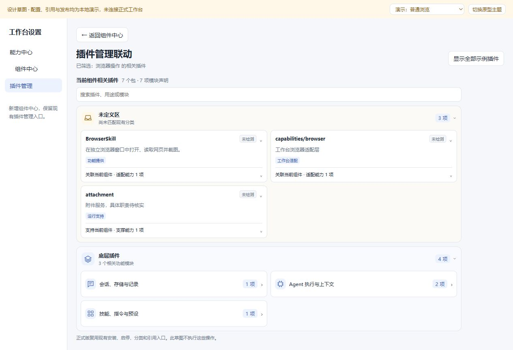
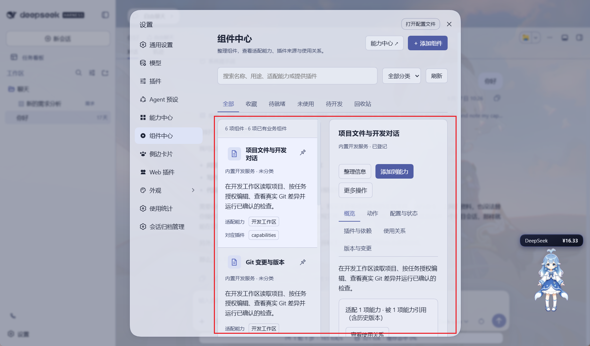
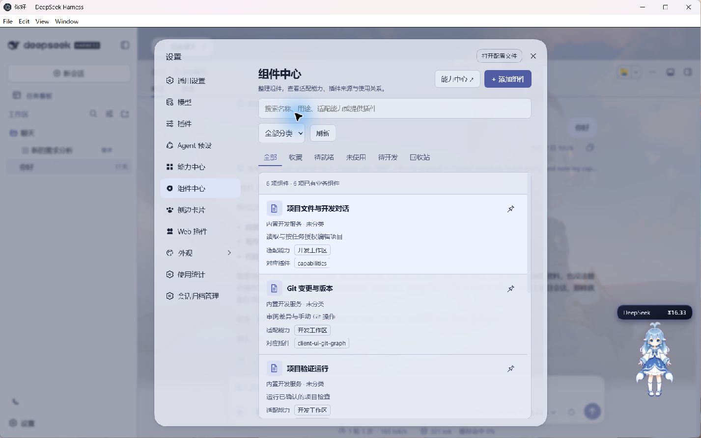
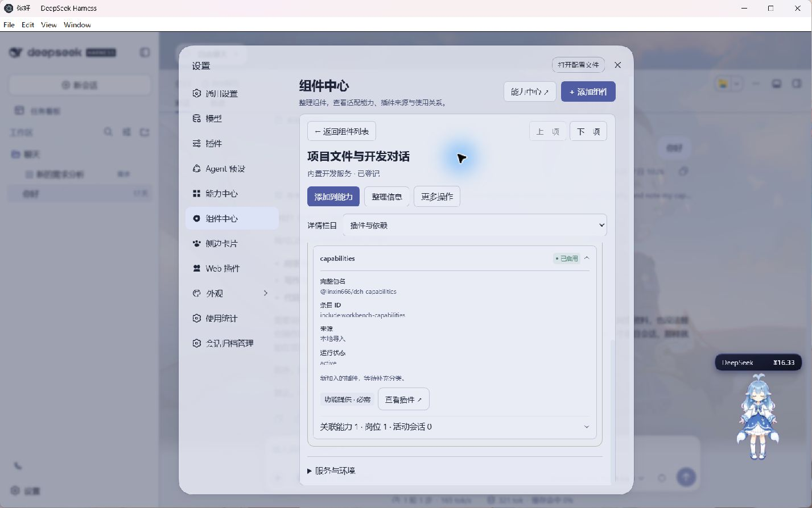

# 统一组件中心与能力增强方案

> 协作迁移说明（2026-10-10）：本文件保留历次方案与执行记录；当前状态以[事项台账](../../PEFR_PLAN.MD)及本文件最新记录为准。旧版本界面、发布流程和本机路径不自动成为现行要求。`<WORKBENCH_ROOT>` 表示克隆后的工作台根目录，`<SECONDARY_WORKSPACE>` 表示作者本机隔离验证目录，后者不是协作开发前提。


用户已确认新增组件中心并联动插件管理，V0.4 基础功能已实装。2026-10-04 用户审阅拥挤布局优化方案后授权执行，V0.5 已完成正式同步：按组件中心自身宽度切换列表与全宽详情，紧凑具体摘要、全量关系标签、共享插件卡片与往返滚动保持。实装、实际窗口验证和回退记录见第二十九节。随后用户反馈返回逻辑问题，第三十节记录实际复现、来源状态缺口与修复建议；原检查时返回修复未执行，现已按用户授权完成，见第三十二节。第三十一节进一步审查新增管理与会话选项卡，记录未保存保护、旧请求重放和栏目记忆异常；第三十一节为修复前检查记录；本轮已获授权实装全部报告问题的修复，提交、验收与回退见第三十二节。

> V0.4 基础实装记录见第二十七节；V0.5 原方案见第二十八节，已获授权并实施。第二十九节两张图片来自实际桌面设置窗口，主要路径已验证；完整窗口尺寸、系统缩放与深色主题矩阵仍待补充。原 [可点击交互草图](A019-组件中心交互草图.html) 及历史预览继续作为设计参考，其中配置、数量、任务与发布为合成演示。

编号 A019，记录来源为助手按项目规则自动维护，更新时间为 2026-10-04。返回 [工作台事项台账](../../PEFR_PLAN.MD)。相关依据：[插件管理](A012-插件分层分类与离线管理.md)、[浏览器能力](A013-BrowserSkill实际接入执行方案.md)、[会议组件统一](A016-会议纪要助手真实录音接入.md)、[需求分析](A017-需求分析助手拓展基础方案.md)、[开发助手](A018-开发助手拓展基础方案.md)。历次方案与实装记录保留；本次客户端布局与联动修改已实装，当前业务配置和数据保持。

## 一 需求范围和设计结论

用户最初发现开发工作区的组件似乎没有出现在插件列表，希望统一梳理组件，以便增删改和强化能力。本次进一步要求明确 UI、操作流程、实现方法、扩展与兼容。

推荐保持现有岗位、能力和插件三个入口，在能力中心标题区增加“组件中心”。默认仍进入现有能力列表；组件中心提供全局组件库。插件负责代码安装和加载，组件负责功能单元，能力负责组件及动作组合，岗位引用已发布能力。两种管理页面共享来源及引用数据。

组件与插件是多对多关系：一个组件可以依赖多个插件，一个插件可以提供多个组件。列表先显示功能名称；详情沿用插件管理分类，在插件卡片上区分功能提供、工作台适配和运行支持，另收纳共享服务及外部环境。它们不能全部被当作可以卸载的组件成员。

| 用户要完成的事情 | 主要入口 | 结果 |
| --- | --- | --- |
| 找组件、了解用途和来源 | 组件总览与详情 | 找到稳定管理对象和真实来源 |
| 梳理别名、分类、标签和备注 | 整理信息、管理分类 | 多页面显示一致，不改变执行权限 |
| 配置服务和项目 | 详情中的真实配置入口 | 使用现有设置，明确范围和生效时机 |
| 给某能力增加或移除组件 | 添加到能力、现有组合编辑器 | 改变能力草稿，按版本发布 |
| 给组件增加实际功能 | 登记新协议和实现版本 | 经过执行适配、验证和升级检查 |
| 让组件退出使用 | 停用、退役、回收站或删除 | 分别处理执行、新装配和无引用清理 |

## 二 已有基础与需要补足的缺口

正式源码已经登记六项业务组件：项目文件与开发对话、Git 变更与版本、项目验证运行、浏览器操作、会议录音转写、需求分析服务。开发、会议和需求使用专用执行路由，跨流程自由混合尚未支持。

| 当前基础 | 本方案复用 | 需要改造 |
| --- | --- | --- |
| components 静态描述及组件 ID | 内置登记种子、动作和兼容边界 | 服务端登记视图、多来源、用户整理信息和版本 |
| ManagedWorkbench 三栏编辑器 | 搜索、添加、拖放、去重、侧栏和排序 | 提供明确的“管理组件库”入口，避免统一标成管理能力 |
| ComponentComposition 关联列表 | 紧凑行、移除确认、必需项缺失、撤销和补回 | 详情、状态及组件库读取统一登记视图 |
| ComponentService 模块适配 | 浏览器、会议、需求、开发的差异说明 | 可登记的适配协议，避免新增模块就改封闭枚举 |
| useCapabilityDefinition 共享草稿 | 同一窗口详情与编辑器往返保留 | 独立整理草稿；字段冲突比较；刷新保护策略 |
| 插件分类与离线安装器 | 原分类、导入、替换和回退流程 | 提供全部组件、反向依赖和完整卸载影响 |
| 现有组件与插件导航事件 | 兼容旧链接 | 增加组件 ID、具体条目身份和返回上下文 |

已核实插件页面使用 find 取首个组件及包名前缀兜底，会漏掉同一来源的其他组件。现有引用函数不覆盖所有历史岗位版本和独立任务服务，不能直接作为全局删除依据。

现有动作类型是封闭联合，管理适配也是固定枚举；现有前端多处直接导入静态数组。只增加一个可变服务端列表不会自动实现扩展，必须同步让共享选择器、组合校验和插件关联读取同一登记快照。

## 三 信息架构与页面职责

| 页面 | 负责的事情 | 保持的边界 |
| --- | --- | --- |
| 能力中心 | 管理能力、发布和岗位采用 | 维持原卡片、筛选、收藏与回收站 |
| 组件总览 | 全局查找与整理组件 | 不直接修改所有引用它的能力组合 |
| 组件详情 | 查看功能、来源、状态与影响 | 配置和执行差异通过真实适配入口提供 |
| 组件登记向导 | 登记已有适配资源或待开发需求 | 只有真实适配资源进入可执行库 |
| 能力组合编辑器 | 修改一个能力的组件和动作 | 草稿保存、发布与已发布执行隔离 |
| 插件管理 | 安装加载及包级生命周期 | 保留现有分类；组件中心不另建安装器 |

“组件总览”默认查看业务组件，顶部类型筛选切换全部资源、业务组件、运行依赖和外部环境。未适配和待开发资源可被查找，但明确标出不可装配。回收站属于组件登记生命周期，与现有能力回收站分别说明对象。

## 四 总览布局与空间分配

页面优先适应设置区内部的实际可用宽度。保持宿主导航，不再新增一条永久分类侧栏。顶部依次为返回能力中心、标题和操作、搜索与筛选；下方是组件列表和所选组件详情。

```text
← 能力中心                         组件中心
集中查找和整理组件                 添加组件  整理分类  刷新

搜索组件名称、用途或提供插件……      类型   状态   分类
全部  收藏  待就绪  未使用  未适配  回收站

组件列表                         所选组件详情
图标 名称  来源  状态  收藏       名称 来源 摘要  操作
用途与动作摘要                   概览 动作 配置 插件与依赖 使用 版本
全部适配能力标签及对应插件标签             当前选项卡内容
……                               … …
```

树形文本说明区域位置；它是布局示意，不代表插件加载或组件执行顺序。

| 区域 | 建议尺寸与行为 | 原因 |
| --- | --- | --- |
| 页面标题 | 沿用既有标题和按钮尺度，外边距约 16 至 20 像素 | 与能力详情风格一致 |
| 搜索与筛选 | 搜索占弹性宽度；类型、状态、分类为紧凑下拉 | 长名称不挤掉必要操作 |
| 组件列表 | 宽屏约 340 至 380 像素，最小约 300 像素 | 支持名称、摘要和状态，不显示过多包名 |
| 详情区 | 弹性占余下宽度，最小约 420 像素 | 配置和来源能阅读 |
| 分隔与滚动 | 共用分隔样式；列表和详情各自保留滚动位置 | 切换组件不丢失查找上下文 |
| 页面底部 | 阅读状态无永久保存栏；编辑状态出现作用域明确的保存栏 | 避免无修改也提示保存 |

上述数值是设计起点，正式实现按容器宽度和现有字体实测调整。初次显示可选中第一项业务组件；没有结果时显示空态，不把被过滤的旧详情误当作当前搜索结果。

## 五 组件行的能力与插件标签

保留组件名称、用途、图标和收藏。用户标注的行底部改为两组可点击标签：“适配能力”和“对应插件”。两组分别计数，适配几项当前能力就显示几项能力名称；插件按当前组件的提供和适配关系展示，不把同包其他组件支持的能力搬到这行。

| 行内信息 | 新的展示规则 |
| --- | --- |
| 名称与用途 | 保持现有内容和点击选中行为 |
| 适配能力 N 项 | 每个稳定能力 ID 一个名称标签，全部换行显示；已停用但适配仍成立的能力保留状态提示 |
| 对应插件 M 个 | 全部直接提供与适配插件按包身份去重；短名可读，完整身份在提示与详情展开 |
| 运行支持插件 K 项 | 单独的紧凑入口，展开右侧运行依赖；不混入提供插件数量 |
| 当前使用 | 在使用关系中区分草稿、已发布、岗位和历史引用，不能用适配数量代替实际使用 |
| 收藏 | 保持独立图钉和已确认的选中样式，不触发关系跳转 |

例如，项目文件与开发对话显示“适配 1 项：开发工作区”“对应插件 1 个：能力服务”；Git 变更与版本显示相同能力标签，但插件为 Git 工作台扩展。浏览器操作可以显示 BrowserSkill、工作台浏览器适配层所在包，以及单独的五项运行支持插件入口。上述短名是草图说明名，正式界面沿用插件清单的名称、用途、图标和稳定身份；不能另存一份会与插件页面分歧的元数据。

点击能力标签打开只读关系摘要：组件支持哪些动作、此能力草稿和发布版本是否包含当前组件、状态及管理入口。选择“打开能力组合”才进入编辑器，点击标签本身不添加、不发布。插件标签打开现有插件页并定位具体条目；返回保留组件、搜索、选项卡和滚动位置。

标签是独立按钮，与组件选中按钮同级；不能嵌套按钮，也不能因事件冒泡同时收藏、选中、跳转或添加。窄屏自然换行，名称完整可访问，Enter 操作等价。当前规模全部展示；未来大集合如按需分页，应显示总数并提供展开全部入口，不能只显示第一项。

未适配、待开发、来源缺失和关系读取失败分别说明。没有已确认适配时显示“暂无已确认适配”；读取失败显示“适配关系待核实”，不能写成零。组件退役不删适配证据；已移除能力和历史引用从当前标签组退出，保留在使用关系中。

批量整理仍只首期开启分类、标签和收藏。名称编辑不修改稳定 ID、来源或执行权限。

## 六 详情页六个选项卡

| 选项卡 | 内容 | 主操作与交互 |
| --- | --- | --- |
| 概览 | 用途、稳定 ID、来源、装配范围、必需性、限制 | 编辑整理信息；可用业务组件提供添加到能力 |
| 动作与适配 | 每个动作说明、必要权限、输入输出及适配版本 | 查看协议；到目标能力选择动作 |
| 配置与状态 | 加载、配置、检测、调用结果及时间，设置作用域 | 进入现有配置；真实支持时提供检测 |
| 插件与依赖 | 现有插件分组和功能模块的组件相关视图；紧凑卡片；服务与环境折叠区 | 逐层展开插件身份与当前关系，定位现有插件管理；沿用真实设置入口 |
| 使用关系 | 草稿、能力版本、岗位版本、活动与历史任务 | 查看具体对象；模块适配支持时停止相应任务 |
| 版本与变更 | 协议、实际插件与加载构建、影响、变更记录 | 查看升级预览；退役、恢复及允许的清理 |

详情头部固定显示组件名称与类型，常用操作最多三个：整理信息、添加到能力、更多。配置按钮位于配置区和真实需要它的状态提示旁。状态为待开发、来源缺失或旧后端时，显示原因和能采取的下一步。

选项卡在同一组件中切换不重置未保存草稿。切换到其他组件时，整理信息草稿按组件独立缓存，并在原行显示“有未保存修改”。用户退出当前管理页面或刷新时处理未保存内容；普通只读浏览不弹确认。

## 七 插件与依赖的关系展示

“插件与依赖”保留原选项卡位置，内容改为插件管理的当前组件相关视图。分组、功能模块、用途、图标和顺序直接来自现有分类；只筛出与当前组件关联的插件。沿用用户截图的分组容器、两列模块卡片和紧凑插件卡片。关系角色是卡片标签，不再作为三个平行大区域重复铺开。

默认只显示简短范围摘要、相关分类容器和折叠模块。在未定义区直接展示尚未分类的相关插件；已分类插件先显示模块卡片，点击后在模块内展开插件。插件默认折叠完整身份和引用说明，服务与环境整体折叠。

| 层级 | 默认展示 | 展开后展示 |
| --- | --- | --- |
| 范围摘要 | 当前组件相关插件；包数、已确认加载条目数或未核实声明数；进入原插件管理 | 不显示与当前组件无关的全局库存数量 |
| 插件分组 | 现有分组名称、图标、相关数量；未定义区、底层插件和用户其他分组按保存顺序出现 | 当前分组的相关功能模块；未定义区直接列卡片 |
| 功能模块 | 图标、原模块名称、相关条目数量、展开箭头 | 该模块内的紧凑插件卡片；模块跨两列占满可用宽度 |
| 插件卡片 | 原插件短名、真实状态、用途、当前关系标签、折叠引用摘要 | 上半部分完整身份；下半部分当前组件职责、动作范围和引用路径 |
| 服务与环境 | 独立折叠入口及条件数量 | 服务或环境名称、实际状态和已有配置/说明入口 |

插件卡片保留两处独立折叠交互。名称与状态行展开包名、导出模块、entryId、实例范围、实际加载版本和分类来源。底部关系行展开当前组件关系；关系详情中展示职责、必要性、受影响动作、缺失影响及登记依据。默认不放重复箭头、证据段落和多个操作按钮。未知状态明确显示未检测；缺失影响必须来自适配描述。

“功能提供”“工作台适配”“运行支持”说明插件对当前组件做什么；“底层插件”“工作台扩展”等说明它在插件管理里归哪一组。二者分别存储，不按关系角色重新划分类别。组件中心的组件分类也不覆盖插件分类。

以浏览器操作为例：BrowserSkill 为功能提供，能力服务包的 browser 导出为工作台适配，工具、Agent、会话、技能和附件为运行支持；这些插件按现有分类进入对应分组和功能模块。bsk CLI 和浏览器扩展进入底部服务与环境。未取得真实分类的条目留在未定义区。原型分类示例参考现有默认分类，正式版以用户保存分类和实际清单为准。

只统计当前组件相关子集。例如插件管理全局显示底层插件 156 项，组件视图应显示当前组件实际相关项，不照搬 156。包数、导出模块声明数和实际加载条目数使用不同标题。声明可确认、加载身份未知时显示待核实，不用假 entryId 拼出“已安装”状态。

同包提供多个组件的汇总、岗位引用和活动会话沿用插件管理的关系详情；它们不属于当前组件依赖。不能把能力服务包的会议和需求组件灌入开发组件依赖树。当前组件适配的能力来自组件适配关系，不能继承同包所有能力。

“在插件管理中查看”打开现有插件管理并带上当前组件筛选；“定位插件”再补具体导出、entryId 和实例范围，展开命中的分组及条目。插件管理仍负责分类、安装、启停和包级生命周期。当前组件视图不复制这些表单。返回时保留来源页面筛选、选择、各层展开状态和草稿；导航滚动恢复仍需正式实现验证。

正式实现先把 InventoryTree 的分组、模块和卡片抽为共享视图，通过筛选集合和关系插槽提供组件上下文。共享分类快照和关系解析负责事实，业务适配器负责差异。不能拷贝一套缩小后的插件管理页面，长期维护两份分类和状态。

## 八 状态模型与空白错误界面

状态分开处理五个维度：登记生命周期、装配完整性、来源安装加载、服务配置检测、具体任务结果。列表按优先级摘要展示，详情保留全部维度和时间。

| 情况 | 界面 | 允许的行为 |
| --- | --- | --- |
| 首次加载 | 组件行骨架或读取提示 | 尚无数据时不显示零组件结论 |
| 无搜索结果 | 无匹配组件，提供清除筛选 | 搜索不改变分类和生命周期 |
| 来源未安装 | 缺少实现来源，列出依赖 | 查看来源、进入既有离线导入 |
| 已安装未加载 | 待加载或待正常重启 | 查看实际安装与当前加载版本 |
| 已配置未验证 | 配置已保存，尚无实际验证 | 运行支持的检测，或进入实际任务 |
| 服务离线 | 状态检测失败、更新时间 | 重试；历史详情可读，破坏性操作暂停 |
| 旧后端 | 只读兼容模式，所需服务待更新 | 浏览既有信息，保存可导出的非敏感整理内容 |
| 草稿缺少必需组件 | 可保存草稿，发布阻断，补回入口 | 补回、撤销、重新选择动作 |
| 引用未核实 | 引用数据不可用，不显示零引用 | 查看已有缓存及时间，刷新后再处理生命周期 |
| 保存冲突或结果未知 | 保留草稿，说明其他修改或正在核实结果 | 比较冲突字段，查询操作结果后再重试 |

开发组件的全局服务状态不能替代项目级检测。地址已填写不能显示已连接；旧配置的检测记录在配置修订变化后标为过期。状态说明用可读文字，颜色只作辅助。

## 九 搜索筛选分类与收藏交互

搜索覆盖名称、用户别名、用途、标签、组件 ID、所有已确认适配能力、提供与适配插件，以及运行支持插件。能力别名和插件完整包名也可命中；搜索不只读取第一项 scope 文本。输入后适度延后过滤，避免每个按键发送请求；清空搜索恢复原筛选和滚动位置。中文名称与包名均支持查找。

类型、状态、分类和搜索采用交集，页面显示筛选条件及结果数。“收藏、待就绪、未使用、未适配、回收站”是快捷视图，不能与类型筛选混成互斥分类。未使用默认指无当前使用，历史引用在详情单列；删除判断仍覆盖历史。

“整理分类”打开与既有分类编辑方式一致的界面，支持新增、改名、排序和调整归属。组件分类存放独立的用户信息，不覆盖插件分类。删除分类时指定组件去向，允许回到未分类；只在用户保存后落盘，不改变启停或装配。

收藏可以即时保存并在失败时回滚显示，提示原因；分类和多字段信息编辑采用明确保存与取消。保存中的相同操作禁用，其他只读导航保持可用。分类和收藏不写入能力版本。

## 十 新增组件的向导与执行条件

向导分成选择来源、核对组件、配置与校验、检查并登记四步。每一步显示内容和下一步条件，允许回到前一步，不提前写入正式记录。

| 路径 | 选择来源 | 核对与配置 | 登记结果 |
| --- | --- | --- | --- |
| 已有插件 | 选择真实包和加载实例，读取声明组件清单 | 查 ID、动作协议、适配器、依赖、兼容范围 | 已适配且执行服务存在才允许装配 |
| 已有服务 | 选择宿主已支持的协议适配器 | 复用对应设置，记录检测结果和适用范围 | 依据检查显示待配置或已适配，不伪造成功 |
| 待开发需求 | 填名称、用途、期望动作和来源计划 | 不提供执行路径或凭据字段 | 登记为待开发，退出可执行组件库 |

已登记同一来源及组件 ID 时，打开已有组件，不重复创建。相同 ID 的不同实现、加载实例或不兼容协议进入冲突说明；不能用重命名隐藏冲突。更新已有来源通过版本升级，不覆盖旧登记。

“从已有插件登记”只读取受管包的声明，不为扫描执行未知代码。ZIP 或文件夹导入跳到现有插件导入器；导入器保留依赖检查、替换、备份和回退语义。安装后的状态标为待加载，实际重启加载后再核实登记。

待开发组件完成实现后，经过构建、适配及真实动作验证，再登记为可用新版本。此时校验依赖、权限、配置和组合兼容，才能显示“添加到能力”。输入一个动作名称本身不产生执行功能。

## 十一 添加到能力与三栏编辑器联动

点击“添加到能力”先打开能力选择器。兼容能力列为可选项，不兼容能力仍可查看原因；不在组件总览直接修改所有能力。选择后打开目标能力的既有组合草稿，并将该组件作为一次草稿变更加入。

| 操作 | 结果 | 必须保留的行为 |
| --- | --- | --- |
| 选择目标能力 | 进入其当前草稿，焦点落在新增组件 | 名称、说明、已有动作和未保存草稿 |
| 点击加号或拖入 | 同一添加命令，去重并定位当前项 | 落位反馈、键盘等价操作 |
| 重复添加 | 不增加重复关联，提示已存在 | 已选动作和草稿不被重置 |
| 移除组件关联 | 确认影响后改变当前草稿 | 必需项也可移除，支持撤销与补回 |
| 调整动作 | 只允许该版本已适配动作 | 岗位权限覆盖仍只能缩小范围 |
| 调整列表顺序 | 改变显示顺序 | 普通排序不能暗示执行编排 |
| 查看组件库或配置 | 打开对应管理入口 | 当前组合、动作、左右栏和滚动位置 |

组件中心的总览采用列表与详情两区；装配页继续采用组件库、当前组合、组件信息三栏，不创建第二套装配实现。旧 ManagedWorkbench 的管理链接应改为可传入语义标签，组件编辑器显示“管理组件库”，岗位装配仍显示“管理能力”，不能全局改成同一名称。

浏览器保留当前可组合范围；会议、需求和开发继续按已适配能力范围提供组件。混合这些执行流程必须先实现数据传递、执行路由、权限及版本支持，不能只开放拖入。

## 十二 四类修改与草稿保存

| 草稿或设置 | 存储范围 | 保存和取消 | 跳转或退出 |
| --- | --- | --- | --- |
| 组件整理信息 | 别名、备注、分类、标签、收藏 | 保存后更新统一展示；取消恢复已保存值 | 各组件独立缓存，离开管理页提示未保存内容 |
| 能力组合草稿 | 一个能力的组件、动作及说明 | 保存草稿不发布；取消或放弃明确说明全部字段范围 | 沿用共享能力草稿，配置往返保留 |
| 服务配置 | 原服务配置源与原作用域 | 复用既有保存、取消、密钥遮挡及修订检查 | 返回前处理未保存配置，不能偷偷保存 |
| 项目配置 | 指定项目的命令、编辑器等 | 沿用项目设置接口 | 明确项目选择，不能变成所有岗位全局默认 |

用户修改实际功能时进入组件版本管理和开发流程，形成受支持的协议及实现变更。界面允许修改整理信息，但内置组件的稳定 ID、声明来源、动作协议和执行路由由实现维护。

现有共享草稿在窗口内使用内存 Map；页面导航不一定卸载它，整页刷新仍可能丢失未保存内容。因此正式方案不承诺自动跨刷新恢复：先保留现有离开提醒；如加入本地恢复，需明确可存内容，能力中用户文本按原数据规则处理，凭据和服务表单永不进入浏览器草稿缓存。

409 冲突先保留本地草稿并显示已保存新值、本地值与原基准。不同字段的修改可合并，同一字段由用户选择；能力组件和动作集合整体核对，不能只更新修订号然后覆盖他人的变化。现有 rebase 仅更新保存基准，不能直接宣称已经完成三方合并。

## 十三 发布预览与生命周期弹窗

发布能力时展示旧版本与新版本、组件和动作增减、必需项完整性、配置或环境待验项目，以及可选择采用版本的岗位。继续沿用现有授权规则；浏览器发布时减少动作的既有撤权行为保持原语义，不因界面改造扩大或弱化授权。

| 操作 | 弹窗展示 | 后端检查与结果 |
| --- | --- | --- |
| 移除草稿关联 | 当前能力、受影响动作、缺失与补回说明 | 仅修改草稿，允许缺失保存，发布阻断 |
| 全局停用 | 所有受影响能力、岗位和运行任务，真实停止能力 | 先撤销相关新调用，再按适配器处理任务；未适配不开放 |
| 退役 | 新装配和新发布受限，已有发布引用保留 | 保留登记和实现；现有版本继续解析 |
| 恢复 | 恢复可装配状态，提示此前启停状态 | 不自动启用或更新岗位 |
| 永久删除 | 目标和全部历史引用检查结果 | 仅无引用自定义登记可删，内置登记不独立删除 |
| 卸载插件 | 所提供全部组件及直接和间接影响 | 复用插件流程，重新核实引用与任务 |

影响预览携带目标、操作、登记修订、能力修订和任务摘要版本。确认时重新校验，有新任务或引用变化则返回冲突并刷新影响。执行服务以同一停用或变更门控阻止检查后又创建新调用，不能只依靠前端按钮或两次非原子查询。

运行中的 Git 提交、恢复等不可安全中断操作不强制终止，显示等待或无法停止原因。组件正在执行、引用服务离线或未知历史引用时，生命周期操作显示具体限制；“卸载基础包”不能由其内部组件删除入口触发。

超时未知结果先查询操作 ID 和状态，或读取最新登记，不能重复发起登记、删除和发布。正常退出或取消弹窗不造成后台提交。破坏性操作均在单独影响确认页完成，菜单点击本身不执行。

## 十四 窄屏键盘主题和动效

| 情况 | 行为 |
| --- | --- |
| 容器宽度约 1000 像素及以上 | 列表与详情并排；详情最小可读宽度优先 |
| 容器约 720 至 999 像素 | 总览先显示列表，点组件进入同区域详情；返回保留列表状态 |
| 容器低于约 720 像素 | 工具栏换行，详情选项卡可横向滚动，关系列表换行，按钮保留文字 |
| 三栏装配编辑 | 沿用现有侧栏收起恢复和窄屏抽屉，不重新实现拖拽缩放 |
| 键盘选择 | 组件主按钮可聚焦，Enter 打开；图钉和菜单独立可操作 |
| 选项卡 | 正确的 tablist、tab、tabpanel 关系，方向键切换焦点，选中状态清楚 |
| 弹窗 | 限制焦点在弹窗内，Escape 返回，关闭后焦点回原按钮；有提交或未保存内容时按语义处理 |
| 拖放 | 保留按钮添加和键盘等价操作；Escape 取消，不依靠拖动完成唯一任务 |
| 深色主题 | 复用宿主设计变量；文字、禁用、错误和选中状态可辨认 |
| 减少动态效果 | 尊重系统设置；收起和落位减少位移，反馈改为轻量提示 |

断点按组件中心容器测量，不只看浏览器窗口。设置侧栏展开后可用宽度会变小，布局应重新判断。正式实现用现有 ResizeObserver 思路，布局变化保留选中项和草稿，不因为转入窄屏就关闭编辑。

建议沿用 8 至 12 像素圆角、现有按钮和图标尺度、淡边框和蓝色强调。危险文字与确认按钮使用既有错误色，正常详情不铺大面积警示色。入口、图标和动效遵守工作台第八节与第九节。

## 十五 统一描述与多来源数据模型

采用“来源声明、用户整理信息、运行状态”分离的模型，由登记服务合成唯一视图。组件动作和真实来源来自实现，用户信息覆盖展示字段，运行状态由适配器提供；三者不能相互冒充。

| 数据组 | 建议内容 | 兼容规则 |
| --- | --- | --- |
| 身份与版本 | 稳定组件 ID、描述协议版本、组件动作协议版本 | 六项现有 ID 不变，名称可改但 ID 不变 |
| 功能描述 | 原名称、用途、图标、动作说明、输入输出、权限 | 只接受已登记动作及真实执行路由 |
| 实现来源 | 多个包、导出模块、加载条目、实例范围及关系角色 | 原 provider 和 pluginModule 作为旧格式映射保留 |
| 依赖 | 插件、服务、环境和必要性、版本范围 | 原字符串依赖通过兼容适配转为类型化关系 |
| 管理能力 | 可配置、可检测、可装配、可停止、可退役及限制原因 | 由服务声明，界面按支持的操作显示 |
| 组合约束 | 适配流程、能力 ID、动作组合、互斥与必需关系及校验结果 | 遍历能力中心实际对象并验证，不能只使用笼统 scope 标签 |
| 用户信息 | 别名、分类、标签、备注、收藏及用户信息修订 | 包升级不会覆盖用户整理 |
| 生命周期与状态 | 候选、可用、停用、退役、检测时间和修订 | 状态分维度，未知值可只读展示 |

实现来源与依赖都可以包含多个插件，但角色不同。主实现发生变化需要升级适配；单独关闭支持插件也可能影响其他组件，因此来源清单不能被设计成可随意勾选删除的插件列表。

能力适配关系、插件来源关系与实际使用引用分别登记；关系列表和反向索引见第二十四节。精确身份至少区分包、导出模块、稳定加载条目和运行范围。相同包不同会话预设或项目实例不共享错误的状态。无法找到某条目时保留登记并标注缺失，不因为搜索无结果就自动删除组件。

## 十六 扩展接入与共享界面机制

新增组件遵循声明、适配、校验、登记四步。组件描述负责让管理界面理解它，宿主适配器负责配置、状态、执行与任务。新组件不必复制列表、详情和编辑器，但增加一种从未支持的执行协议仍需要实现适配器。

| 适配职责 | 返回或提供的能力 | 共用界面如何使用 |
| --- | --- | --- |
| 读取组件描述 | 身份、动作、来源、约束与支持操作 | 统一列表、搜索、收藏、详情和组件库 |
| 配置入口 | 实际界面及命名空间、作用域、生效规则 | 跳转既有配置；不另存一份设置 |
| 状态查询 | 多维状态、原因、检测时间、配置修订 | 标注已配置、待验证、待加载和失败 |
| 组合验证 | 必需性、动作完整性和执行兼容问题 | 前端预览和后端发布使用同一规则 |
| 执行路由 | 动作到受控实现的解析及授权校验 | 只有路由存在的动作可执行 |
| 任务摘要与取消 | 任务版本、所用组件、状态、入口、停止边界 | 使用关系、生命周期影响和正确任务操作 |

主界面按管理能力声明渲染；图标有默认回退，新增图标由受支持资源登记。管理适配键改为可登记标识，动作 ID 使用稳定命名规则；现有八种动作保持原 ID 和权限含义。未知动作名称不会自动变成授权，必须存在服务端描述、处理器及权限映射。

特殊 UI 通过宿主登记的受信任配置或详情插槽扩展。插件清单不能指定任意脚本、任意 URL 或随意注入表单；未支持的配置协议显示明确入口或限制。单个适配器异常隔离为该组件状态错误，不让整个组件总览空白。

要完成一次接入，需要同时通过管理列表、详情、配置往返、装配、发布校验、执行授权、任务引用和卸载保护。只成功显示一张卡片不算接入完成。

## 十七 前后端服务与导航分工

| 层 | 负责内容 | 本轮实现时需要的改变 |
| --- | --- | --- |
| 共享协议层 | JSON 描述、状态、动作、引用与操作请求 | 与宿主服务解耦，前端不导入 Node 服务 |
| 登记服务 | 合并来源与用户信息、版本、生命周期、精确映射 | 现有静态数组作为种子，统一列表快照为运行数据源 |
| 引用服务 | 能力和岗位所有相关版本，各模块任务，反向依赖 | 修正首个匹配；按唯一实体和版本分别计数 |
| 校验与命令服务 | 版本检查、影响确认、串行写入、幂等与事务 | 直接 API 请求也受相同规则约束 |
| 组件中心前端 | 总览、详情、整理和登记流程 | 共用紧凑行、状态、弹窗与草稿框架 |
| 能力前端与发布服务 | 基于统一快照的组件库和组合校验 | 共享选择器显式接收登记视图，避免继续读旧常量 |
| 插件管理适配 | 多组件反向关联、精准条目跳转、包级影响 | 原安装器和分类保留，不再添加第二份插件配置 |

拟增加列表、详情、引用、影响预览和操作结果查询；写命令覆盖整理信息、候选登记、退役、恢复及允许的删除。端点名称在实施时按现有接口约定确定，不把方案中的名称当成已有可调用接口。

导航协议新增组件中心目标、componentId、详情选项卡、具体插件身份和返回上下文。现有 section 为 capability-center 或 plugins 的链接继续解析；旧链接没有新字段时回到原入口。上下文只存导航与非敏感视图状态，不携带配置密钥。

现有十五秒可见页面刷新可复用为首版策略。关系快照同时携带登记与能力状态修订，各页面使用相同统计口径。成功写入后主动刷新相关视图，窗口重新获得焦点时更新；编辑时更新基准数据但不覆盖本地草稿。后续可增加事件通知优化实时性，首版不依赖新增消息服务。

## 十八 客户端协议与旧数据兼容

组件中心协议需要独立的版本及功能声明。现有 compositionVersion 只表达组合编辑服务版本，不能复用它来宣称登记、删除、升级和任务聚合都受支持。

| 场景 | 应有行为 |
| --- | --- |
| 新前端配旧后端 | 读取旧 components 快照并转换为只读总览；新写操作停用且解释所需服务 |
| 旧前端配新后端 | 保留现有 components、动作及组合接口；新增字段为可选，旧组合不被忽略或擅自改写 |
| 包已安装但宿主未重启 | 分别展示已安装与实际加载版本，提示正常重启后再用需要的新功能 |
| 登记中有未知资源类型或状态 | 保留只读信息和原值，未知操作不开放 |
| 新字段被旧编辑流程打开 | 服务端以补丁命令更新已知字段，保留扩展数据；不接受旧客户端覆盖未知版本记录 |
| 提供插件升级或路径迁移 | 按稳定身份和登记来源修复关系，保留用户信息与历史引用 |

兼容底座包含旧字段解析、接口保留和支持操作协商。只读兼容不能冒充新后端支持。后端遇到未知的必需协议或动作拒绝发布，前端则展示具体版本要求。

初次登记是幂等迁移：已有六项 ID、能力、岗位、动作和历史任务保持。组件信息采用旁路存储，插件分类仍在原文件。用户草稿不自动补回已移除组件；来源缺失不删引用。

## 十九 组件协议与实现代码的版本兼容

同时展示组件协议版本、能力版本、岗位版本、已安装插件版本和当前加载构建。协议约束功能和授权；实际插件构建决定运行代码。二者不能用同一个 v1.0.0 混合表达。

新能力关联可以记录组件协议版本，新任务记录能力、岗位、组件协议、实际实现身份及非敏感配置修订。旧 componentId 与 actions 按旁路映射解析到既有协议，历史文件不重写；无法确认的历史引用标为待核实。

提供包升级会同时影响它实现的多个组件。当前单实例运行模式不提供天然的旧代码隔离，新实现必须兼容所有仍被引用的协议，或阻止替换并给出迁移路径。固定旧组件协议不代表旧执行代码已经单独存档或同时运行。

| 变更 | 兼容处理 |
| --- | --- |
| 用户别名、标签或备注 | 更新展示，不新增执行权限 |
| 增加可选动作 | 产生明确的新协议支持；旧能力和岗位不会自动授予 |
| 删除或改变旧动作 | 保留兼容实现或先迁移相关引用；直接覆盖不通过升级检查 |
| 更换依赖或提供包 | 核对版本、加载范围、配置与权限，记录新实现身份 |
| 数据结构迁移 | 备份、幂等迁移、向前读取兼容和失败恢复；代码回退不自动逆转数据 |

退役停止新装配而保留旧引用解析；停用改变执行授权。永久删除无引用自定义登记和卸载实现代码的检查分别执行。回退分别处理登记、服务配置和实际插件代码，不能用恢复一份旧能力状态覆盖新任务。

## 二十 一致性性能与数据保护

引用索引由源数据生成，可以重建，不能成为唯一删除依据。最终永久删除检查读取所有能力草稿及版本、岗位历史版本、任务记录和依赖关系；模块数据读取失败时状态是未知，不是零引用。

保存操作使用登记修订及具体对象修订，串行写入并原子替换持久文件。涉及多个文件或包链接的升级沿用事务记录和失败恢复；操作 ID 用于处理重复点击与超时未知结果。组件修改门控与新任务授权必须相互一致。

首版只有六项业务组件，使用普通列表与局部过滤即可。组件数量增长时采用分页、来源与状态索引、按详情懒加载任务和版本；达到实测瓶颈再增加虚拟列表，保证键盘焦点和选中项仍能定位。不要每次输入都遍历全部任务文件。

建议以包含五百个登记项的合成数据做扩展检查：默认页面不一次展开全部历史任务，搜索与选中切换保持可用；性能结果记录实测环境和耗时，不先宣称毫秒级承诺。影响预览可以分批加载列表，但最终后台校验必须检查完整集合。

组件描述和来源文本按纯数据渲染，备注不执行 HTML。凭据仍由原配置服务保存和遮挡，不进入登记、版本、导出、日志或普通状态响应。服务配置源与组件用户信息分别保存，校验操作沿用既有认证和本机来源限制。

## 二十一 分阶段交付与验收门槛

| 阶段 | 实际交付 | 重点验收 |
| --- | --- | --- |
| 第一阶段 总览与统一数据 | 六项组件及资源视图、六详情页、整理信息、唯一配置、完整只读引用和插件联动 | 来源准确、多组件去重、导航草稿保持、旧后端只读、主题窄屏 |
| 第二阶段 登记与生命周期 | 三来源向导、分类、候选、退役恢复、自定义登记删除和影响预览 | 重复与冲突、无适配不装配、历史和未知引用保护、幂等保存 |
| 第三阶段 功能升级 | 协议与实现版本、升级兼容、跨模块停止与全局停用适配、新任务快照 | 旧授权不扩张、真实执行、取消边界、包级影响与实际回退 |
| 后续按具体需求 | 专用流程跨模块组合 | 真实路由、数据传递、版本和授权齐全后才开放 |

| 验收场景 | 必须达到的行为 |
| --- | --- |
| 从开发工作区找组件 | 三项组件详情可打开，实际提供包及建议依赖清楚 |
| 同包提供多个组件 | 全部组件出现，能力、岗位、任务按稳定 ID 去重 |
| 搜索收藏分类 | 筛选组合正确；收藏失败回滚；删除分类不删组件 |
| 增删组合 | 点击、键盘和拖入同结果；必需项可移除、撤销、补回；重复添加不重置动作 |
| 缺失草稿与发布 | 保存重开不自动补回；直接后端发布也被阻断；已发布任务不受草稿影响 |
| 配置往返 | 原配置唯一；未保存配置提示；能力草稿和选中项保留 |
| 两窗口同时编辑 | 冲突保留本地内容，不能盲目更新基准覆盖其他修改 |
| 超时与双击 | 查询结果后再处理，不重复登记、发布、删除 |
| 插件未加载或旧服务 | 安装与加载分开；只读兼容准确；不出现假可用按钮 |
| 生命周期并发 | 新任务或引用变化触发预览重算，服务端拒绝陈旧影响 |
| 老版本升级 | 老动作协议继续可读可执行或替换被阻断，代码和数据回退边界明确 |
| 跨模块回归 | 浏览器、会议、需求、开发原执行行为；岗位卡片、顶部入口和新对话联动保持 |

正式实施按阶段保存代码、实际运行包和必要数据基线，独立提交并按既有离线方式部署。类型检查、必要行为测试、构建和真实界面检查按范围执行；真实服务验收另行报告，原待验项不自动改成已完成。

## 二十二 原型范围与后续实施依据

交互草图用于评估列表和详情布局、筛选搜索、整理信息、插件双向关联、能力选择、必需项移除、草稿保存、发布检查、候选登记和退役恢复。它是可操作的本地模拟，所有业务状态和引用示例都不来自正式数据。

首版布局和交互是本方案建议，正式实现继续复用当前 React 组件与设计变量；草图的演示控制和示例数据不进入产品流程。原型不用于证明正式插件已加载、服务已连通或任务已执行。

V0.2 原型核对记录：默认桌面视图、660 像素和 390 像素视口下没有页面横向溢出，窄屏支持列表与详情切换；深色布局与选项卡键盘末项切换可用。已点击核对同包五项关联展示、组件回跳、兼容能力选择、必需项移除后的缺失草稿保存、配置往返、补回和空动作发布阻断、发布前版本影响预览、冲突时保留本地输入、旧后端只读，以及待开发登记不能装配。浏览器未捕获脚本错误；脚本语法检查通过，草图无外部资源和正式业务请求。

这些结果仅证明本地模拟的交互路径。正式数据持久化、页面刷新后草稿恢复、真实执行、插件升级、拖放排序、可调侧栏、生命周期并发和完整历史引用检查仍需实施后的回归，不能由原型验收替代。

V0.3 原型核对记录：正常视图中六个业务组件分别显示能力标签和插件标签；能力服务包五个关联组件汇总为四项能力，开发组件未错误获得同包会议、需求或浏览器适配标签。浏览器详情分开显示两项提供与适配插件、五项运行支持插件和两项外部环境，支持清单可展开。工具服务只计运行支持，不冒充直接提供能力。合成情景下一个组件的三个能力标签全部显示，支持通过能力名称搜索，Enter 打开只读关系摘要，未生成嵌套按钮。由标签打开原三组件组合没有新增关联；插件往返保留 Git 组件与搜索条件。390 像素窄屏的三标签换行和深色关系页没有页面横向溢出，脚本语法及无网络调用检查通过。

以上是合成数据的界面与导航验证；真实适配枚举、稳定加载条目、多实例选择、完整历史引用和服务端并发状态仍须实施后验证。导航滚动恢复没有作为本轮原型完成项，正式界面应按本方案实现。




[查看组件详情内的功能模块与支持插件展开](A019-组件内模块预览.jpg)

[查看三项能力标签的合成情景预览](A019-多能力关系预览.jpg)

关键源码位置相对于 deepseek_harness_desktop：core/model.ts、core/composition.ts、core/validation.ts、host/store.ts 与 index.ts 位于 packages/dsh-capabilities；ManagedCenter、ManagedWorkbench、ComponentComposition、ComponentService、capability-client 和 useCapabilityDefinition 位于 packages/dsh-client-ui-plain-chat/src/client；CapabilityReferences、InventoryTree 与分类协议位于 packages/dsh-plugin-manager。

方案阶段只更新 A019 和 T026 的设计资料（本次授权后的实装见第二十七节），附加分类卡片草图及验证记录。方向“新增组件中心并联动插件管理”已由用户选择；能力与插件分别展示方向已由用户选择，本轮按用户截图延续原插件管理形式；具体关系呈现、生命周期和技术实现仍待审阅，未执行正式应用改造、安装、部署或数据迁移。

## 二十三 标注图的问题与本轮修改范围

前两张截图要求组件行显示适配能力与对应插件，并指出依赖与来源页看不出关系。V0.3 已补齐标签和角色，但把关系说明、完整包名、动作影响与证据直接铺开，造成新的阅读负担。本轮截图明确偏好现有插件管理：分组容器、两列模块卡片、紧凑插件卡片和底部可展开引用。

依据截图：[能力与插件标签标注](A019-用户标注-能力标签.png)、[旧插件关系区域标注](A019-用户标注-插件关系.png)、[本轮分组及卡片参考](A019-用户标注-分类卡片.png)。左侧“适配能力与对应插件，分别展示”已获用户选择，本轮保留。

| 用户感受到的问题 | 结构原因 | 本轮修正 |
| --- | --- | --- |
| 插件和依赖仍然杂乱 | 以关系角色分成大清单，偏离已有插件分类的认知路径 | 现有分组 → 功能模块 → 插件卡片；角色改成卡片标签 |
| 一打开就像读技术文档 | 每张卡片都展开包名、箭头、证据、动作和影响 | 首屏简短；身份和关系分别折叠 |
| 与原插件页风格和用途重复 | 只复用了名词，没有复用结构与交互 | 共用分类树、模块卡片和插件卡片；原页继续负责管理操作 |
| 看不出是全部插件还是当前依赖 | 包级汇总与当前组件关系混用 | 明示当前组件范围；分类数量、搜索和关联均在此范围内 |
| 不清楚组件为什么用这个插件 | 只有名称和抽象角色，没有具体对象 | 卡片标明当前关系；展开明确当前组件、职责、动作与能力路径 |
| 分类可能越来越多套 | 用“支持插件”等角色替代真实分类 | 插件分类只在原管理页维护；角色与组件分类独立 |
| 服务、CLI 与插件混在一起 | 统一大卡片弱化对象差异 | 服务与环境底部独立折叠；使用原设置或说明入口 |

此处记述方案阶段对 A019 和本地草图的修改；当时用户偏好支持规整设计，尚未授权正式实施。本次后续实施授权及结果见第二十七节。保留插件原有安装、分类、启停、状态、配置和能力组合规则。

## 二十四 关系解析与数量统计

统一关系快照由三类数据形成：组件声明和受信任适配器、当前能力及其流程约束、插件实际清单与加载状态。服务端输出带稳定身份和依据的关系，前端负责展示与导航。实际使用由能力草稿、发布版本和岗位任务单独读取。

| 关系数据 | 最小信息 | 事实与校验 |
| --- | --- | --- |
| 组件适配能力 | componentId、capabilityId、流程、动作覆盖、限制及依据 | 受信任适配声明与组合校验，不能凭安装或同包推断 |
| 插件关联组件 | componentId、包、模块、条目、实例范围、角色、必要性及依据 | 主提供、工作台适配、运行支持分别标记 |
| 动作级关系 | actionIds、适用协议版本、服务条件和缺失影响 | 没有证据时保持未知，不自动覆盖所有动作 |
| 实际使用引用 | 能力及版本、草稿、岗位和任务身份、状态 | 与可适配集合分开，保留历史和未知值 |
| 快照状态 | 登记修订、能力修订、清单时间与完整性 | 不同数据源尚未一致时显示正在同步或待核实 |

解析能力适配时，遍历能力中心当前未移除的对象，核对组件支持的流程、能力限制及版本；可适配不要求已经装配。已停用但仍适配的对象保留名称和状态。已移除或仅历史出现的能力放入使用关系；当前状态读取失败不能清零。专用开发、会议和需求组件继续限制原流程，浏览器未限定固定 ID 的情况由现有组合校验确认，不能简单视为适配所有能力。

| 数量 | 去重和纳入规则 | 不纳入 |
| --- | --- | --- |
| 行内适配能力 N | 当前组件已确认适配的稳定 capabilityId | 同包其他组件的能力、历史版本重复、未知适配 |
| 行内对应插件 M | 当前组件提供与适配关系的包身份；一个包多个角色合并并注明角色 | 支持依赖、服务和环境 |
| 运行支持插件 K | 当前组件直接登记的支持包，按包身份去重 | 主提供角色、间接推断依赖、CLI 和扩展 |
| 插件页提供或适配能力 | 该包提供与适配的组件对应能力 ID 的并集，并列出组件路径 | 仅支持关系冒充直接提供 |
| 插件页支撑能力 | 该包运行支持的组件对应能力 ID 的并集 | 没有完整路径或只是名称相似 |
| 当前使用与历史引用 | 按实际实体和具体版本分别显示 | 将版本数当成能力数，将已适配当成已启用 |

根据当前六项声明和四个内置能力，能力服务包可关联五项业务组件，包括浏览器适配层；对应四项不同能力，开发两项组件对同一开发能力只计一次。项目文件组件自身仍只适配开发工作区。这个例子用于说明正确去重，并不代表实际清单或加载状态已读取。

组件页到插件页，以及插件页到组件页使用同一组关系边。旧 provider 映射为声明提供，pluginModule 映射为适配模块；字符串依赖只按已知清单解析成插件、服务或环境，无法确认的保留原值。关系身份、角色与范围精确匹配，不使用 startsWith 包名前缀兜底。

一个包同一组件同时提供和适配时，摘要插件数为一，详情保留两种职责；加载实例数另列。若该包既是提供又是支持，分别显示角色但汇总注明“同包”，不能把两个分组数字相加宣称不同包总数。历史、移除和任务数据只参与对应引用视图及生命周期校验，不能偷偷增加当前适配标签。

旧后端只有声明字段时允许做只读转换，并展示证据范围。无法识别真实能力适配、插件身份或动作关系时显示待核实，不能拼出假按钮。新增关系字段为可选，旧接口和数据保留；前端、组件库、详情和插件关联的共享选择器改读同一快照，保存时采用补丁而不是覆盖未知扩展字段。

## 二十五 修改顺序与本轮验收

| 顺序 | 修改内容 | 目的 |
| --- | --- | --- |
| 一 | 统一适配和插件关系描述、解析及双向索引 | 先确定各数量和角色的事实来源 |
| 二 | 抽出原插件身份摘要、状态和关系行 | 让组件与插件页面复用同一显示 |
| 三 | 保留左侧标签；把右侧改为共享分类卡片及折叠关系 | 关系可见，首屏紧凑，与原插件管理一致 |
| 四 | 完成精准条目定位、返回上下文与能力入口 | 避免仅搜索包名或跳转时丢草稿 |
| 五 | 覆盖旧服务、未知关系与共享模块回归 | 保持管理框架和原执行行为 |

| 验收案例 | 必须得到的结果 |
| --- | --- |
| 同组件适配三项能力 | 三个不同能力标签全部显示，可独立打开，不自动装配 |
| 同能力跨多个版本 | 适配能力数仍为一，版本引用在详情单列 |
| 同包跨五个组件 | 插件页展示五个组件；能力并集去重，组件行不借用其他组件的能力 |
| 同包兼有提供和适配角色 | 行内插件计数一，详情保留角色和导出模块 |
| 浏览器提供与支持插件 | 两项提供适配、五项支持依赖及两项外部环境分别显示，不混计 |
| 删除能力草稿的组件 | 实际使用变化，可适配标签按校验依据保留；已发布引用保持 |
| 无插件的内置服务或环境 | 显示真实来源说明，不生成不存在的插件跳转 |
| 旧服务或读取失败 | 待核实或只读，不显示零关系和假就绪 |
| 标签、图钉和主行点击 | 操作互不冒泡，键盘可用；浏览不增加权限 |
| 多实例、名称变更与返回 | 稳定身份定位，返回时选中组件、过滤和草稿保持 |
| 深色与窄屏 | 名称换行可读，标签不遮挡图钉，关系方向不靠颜色表达 |

本轮原型增加明确的多能力合成情景，专门检验三个标签和去重展示。合成情景不证明当前正式浏览器组件已经接入这些新能力。正式实施的行为测试以关系计算、跳转及原管理模块回归为主，不为纯展示文案增加镜像测试。

## 二十六 按现有插件管理规整的完整方案

目标是让用户在组件详情中，以熟悉的插件管理方式看懂相关插件，并在需要时回到原页管理。视图变窄后调整列数和间距，保持层级、图标、色调、悬停及展开方式一致。首屏回答“有哪些相关插件、属于哪类、有什么作用”；详细职责和完整技术身份按需展开。

```text
插件与依赖
当前组件相关插件                      在插件管理中查看 ↗
搜索插件、用途、功能模块或关系角色

▾ 未定义区                                  相关 N 项
  [插件短名   状态]        [插件短名   状态]
  简短用途                简短用途
  功能提供                工作台适配
  ▸ 当前组件关系          ▸ 当前组件关系

▾ 底层插件                                  相关 N 项
  [会话、存储与记录   N ›] [Agent 执行与上下文  N ›]
  [技能、指令与预设   N ›] [其他相关模块        N ›]
  模块展开：跨两列显示相关插件卡片

▾ 用户已有其他分组                          相关 N 项
  同一套模块与卡片

▸ 服务与环境 N 项
```

实际空分组和空模块不占组件视图首屏。分类不存在或条目尚未确认时进入未定义区，不依据包名前缀猜测用户保存分类。已分类但名称或顺序被用户修改时，同步使用保存值。分组存在但没有当前组件相关项时隐藏；全局管理页仍按原规则展示。

| 内容 | 默认可见 | 展开或管理位置 |
| --- | --- | --- |
| 插件组织分类 | 用户原分组、功能模块、相应图标和顺序 | 原插件管理维护；组件视图只读复用 |
| 插件用途与状态 | 短名称、简短用途、真实加载状态 | 名称行展开完整用途和身份；检测时间来自真实快照 |
| 当前关系 | 功能提供、工作台适配、运行支持；多个角色可并列 | 底部展开当前组件及动作职责，依登记证据展示 |
| 能力与组件引用 | 当前组件关系摘要，按提供与支持分别命名 | 原插件全局汇总和精确引用路径；岗位/活动会话未知时不填 0 |
| 稳定身份 | 可读短名和明确缺失/待核实状态 | 完整包、导出、entryId、scope 与实际实例；同包不同导出不合并 |
| 服务与环境 | 一个独立折叠入口及条件数 | 展开服务名称、状态、作用域及原配置入口 |
| 安装、分类、启停和卸载 | 统一“在插件管理中查看”入口 | 原管理页及已有影响预览，不在组件内复制 |

**展开、搜索和返回。** 分组默认展开，已分类功能模块默认折叠；未定义区直接展示紧凑插件卡片。沿用原分类树支持多个模块展开的行为，展开模块占满模块网格宽度；不额外强制互斥。两个卡片详情各自折叠，不把身份、关系和管理动作强塞进同一次展开。插件树按其实际容器宽度处理，两列在宽度不足约 520 像素时转为单列；不能用桌面整体视口代替详情区宽度。

当前插件搜索只筛当前组件子集，并覆盖完整包名、导出模块、用途、原分类名称和关系角色；命中后临时展开祖先，清空后恢复之前展开状态。搜索字段与页面顶部组件搜索分开。切换组件使用各自的插件搜索与展开状态，避免将浏览器关系残留到开发组件。空搜索结果显示清空入口。键盘支持按钮 Enter/Space 和原生详情展开；焦点、ARIA 展开状态、主题变量和减少动画偏好与原页一致。

进入插件管理时带当前组件筛选，管理页标题明确筛选对象，可以主动切换显示全部。定位卡片同时带具体导出及稳定实例身份，按准确条目展开并滚动；多实例身份不明确时先选择实例，不能只高亮父包。从管理页返回恢复组件选择、组件搜索、组件类型、详情选项卡、插件搜索及分组展开，组合草稿不变。滚动恢复纳入正式回归；本地原型只验证部分导航状态。

**数据与实现。** 现有 InventoryTree 已具备分类层级、模块两列网格、跨列展开、紧凑卡片及引用折叠。应抽取其展示层作为共享 PluginInventoryView，并通过数据和插槽适配；这是建议的新共享接口名，不是已经存在的源码 API。先保证现有全局和会话视图行为一致，再加入组件视图。

| 建议共享接口或数据 | 作用 | 一致性要求 |
| --- | --- | --- |
| inventorySnapshot / classificationSnapshot | 原插件清单、保存分类、加载状态、用途和图标 | 两页同版本快照；不手填两套包名与分类 |
| relatedEntryKeys / pendingDeclarations | 按组件 ID 解析实际相关条目；未知身份保留待核实声明 | 按稳定条目与 scope 筛选；待核实声明不冒充实际加载实例 |
| viewContext | global、session 或 component；携带当前组件 | 会话预设与全局加载分区保持，不能混计或漏掉重复实例 |
| renderRelationSummary / renderRelationDetails | 共用当前与全局关系摘要，按上下文展开职责 | 主提供与运行支持数量不同；同包跨组件引用不变成依赖 |
| capabilities / managementNavigation | 控制可用管理动作和导航 | 组件详情只读；原管理页沿用既有权限及操作限制 |
| navigationContext | 非敏感选择、搜索、展开、滚动和返回来源 | 隔离组件视图状态与全局展开状态，兼容现有导航事件 |

关系解析仍采用第十四至二十四节的统一协议、快照与适配规则。InventoryTree 当前导航只使用 moduleName 搜索；需要扩展为精确条目身份定位。现有 CapabilityReferences 的包级前缀兜底和首项逻辑不能直接用于当前组件关系，先补全精确关系解析再接入共享卡片。兼容旧后端时继续只读显示已知声明，不猜安装状态或提供新管理动作。升级共享分类视图不得覆盖用户保存的分组、功能模块、顺序和用途。

原型本轮用七个插件包/七项导出模块声明演示浏览器关系，其中两项功能提供与适配、五项运行支持；四项支持声明按现有默认分类参考进入底层插件的三个功能模块，附件服务尚未匹配默认分类，因此同另两项声明留在未定义区。原型未读取真实 entryId、实例、启停、用户保存分类或全局 156 项库存；展示的未检测状态和声明计数不能作为正式加载事实。能力服务父包与 browser 导出分别计算关系，不把两者当作同一插件条目。

**修改顺序与验收。** 先抽取现有视图并验证原页，再接统一精确关系和分类快照，最后接组件相关筛选、卡片上下文和导航。以下为正式实施验收门槛。

| 场景 | 必须满足的结果 |
| --- | --- |
| 组件关联少量底层插件 | 原分组和模块显示相关子集，不照搬全局 156 项；包数与加载条目数分开 |
| 一个模块内多个相关插件 | 模块卡片数量准确；展开跨两列，卡片按原排序显示 |
| 插件尚未分类或加载身份未确认 | 未定义区保留；明确待核实，不显示伪造加载成功或伪 entryId |
| 同包多个导出和不同实例 | 父包、browser 导出和实例分别匹配；不同组件能力关系不串联 |
| 一个插件对组件有多个角色 | 卡片并列角色，只生成一条相同实例记录，引用去重规则一致 |
| 服务、CLI 和浏览器扩展 | 底部服务与环境折叠，不进入插件数量及卸载流程 |
| 搜索插件、用途、功能模块和角色 | 只筛当前组件相关项，祖先临时展开；清空还原展开状态 |
| 插件往返与切换组件 | 保留当前选择、过滤、插件搜索和组合草稿，展开状态不污染全局视图 |
| 窄详情区、深色、键盘和减少动效 | 容器内单列可读，无页面横向溢出；ARIA、焦点和主题联动一致 |
| 用户改插件分类或用途 | 组件视图同步使用用户保存结果，组件自身分类保持独立 |
| 原插件页与其他能力模块 | 安装分类启停及引用操作保持；开发、浏览器、会议和需求的共享编辑与回归按正式规则验证 |

V0.4 本地草图核对记录：浏览器组件显示七个包、七项导出模块声明；未定义区三项，默认分类参考下的底层插件四项、三个功能模块。模块展开跨两列，工具与 Agent 两张卡片保持紧凑；名称身份和组件关系分别折叠，Enter 可展开具体适配关系。搜索“运行支持”只命中五项支持声明；搜索“会话”临时展开命中的分类，清空恢复原 Agent 展开和会话折叠状态。插件管理往返保留当前浏览器组件、详情选项卡及插件搜索；切换开发组件只显示其能力服务声明，切回浏览器恢复独立搜索。定位 browser 导出只高亮该导出，不误指向父包。390 像素窄屏为单列，深色及三能力标签无页面横向溢出。脚本语法检查通过，浏览器没有捕获脚本错误，原型没有外部资源或正式业务请求。真实条目解析、用户自定义分类同步、精确实例导航、完整历史引用、滚动恢复及服务端快照一致性仍须正式实施后验证。


## 二十七 组件中心实装与验证记录

本次按用户明确授权实施，复用三项既有模块：能力服务、普通聊天界面与插件管理。正式工作台现已同步能力服务 0.1.0-local.14、普通聊天界面 0.1.0-local.1 的本地构建，以及插件管理 0.3.23 的更新构建。普通聊天仍采用原本地链接方式，插件管理仍采用原实际安装方式；没有替换宿主、清空配置或强制重启正在使用的正式桌面端。

**本次实际交付。**

| 范围 | 已实现的行为 | 作用边界 |
| --- | --- | --- |
| 统一组件入口 | 设置中新增组件中心，能力中心与既有三栏组合编辑器提供管理组件库入口 | 保留原能力中心、岗位卡片、顶部岗位入口和新对话联动 |
| 组件列表与详情 | 六项实际业务组件及候选登记；搜索、分类、收藏、待就绪、未使用、待开发与回收站；六个详情选项卡 | 当前总览管理业务组件与候选，运行依赖和外部环境在对应组件详情内收纳 |
| 左侧关系标签 | 适配能力与对应插件分行展示；实际适配了几项能力就展示几项标签 | 适配关系与已经引用是不同口径，历史引用另在使用关系展示 |
| 插件与依赖 | 共用 InventoryTree，按原分组、图标、颜色、顺序呈现双列模块与紧凑插件卡片 | 原保存分类为唯一来源，组件视图只筛当前组件相关项，隐藏空分组 |
| 插件卡片与关系 | 功能提供、工作台适配、运行支持作为角色标签；身份与引用分别折叠 | 服务与环境独立折叠；来源包或未匹配声明明确说明检测情况，不伪造加载实例 |
| 导航与搜索 | 当前组件内搜索、命中祖先临时展开、清空恢复；各组件搜索与展开分别保留；带筛选及精确身份前往原插件管理 | 全局与预设视图保持原管理行为，安装、分类、启停、卸载仍在原页执行 |
| 整理与装配 | 独立保存名称、说明、分类、收藏；非冲突字段合并，冲突时保留输入；添加到能力进入共享草稿编辑器 | 不修改稳定组件 ID、提供插件或动作契约，不自动发布或扩大已发布任务权限 |
| 生命周期 | 移入回收站、恢复、全局停用与启用；服务端重算引用影响并拒绝过期确认；操作重试去重 | 回收站禁止新增装配与发布；全局停用会撤销相关动作并取消活动任务；完成结果保留 |
| 新增与删除 | 登记待开发候选，候选回收后可以在无引用时永久删除 | 新候选需要真实动作与服务适配器才能执行；内置实现的卸载由插件管理负责 |

**关系和权限校验。** 同包父模块、browser 导出及不同实例按精确身份处理，组件视图不再使用包名前缀继承关系，也不只取首个匹配组件。原插件页汇总该模块提供的全部组件、能力与岗位引用，岗位历史版本按它实际绑定的能力版本解析后去重。包级卸载保护单独依据显式导出所属包计算，不把包级保护口径用于组件卡片的模块匹配。

组件登记保存在能力目录的 component-registry.json，首次实际操作才写入，原 state.json 不增加整理配置。写入沿用单写入锁和队列，并采用临时文件原子替换；新接口沿用宿主认证及来源限制。保存暂缺必需组件的既有草稿仍被允许，发布在前后端同时校验。全局停用记录撤权时间，显式重新启用也不会恢复旧任务授权。浏览器、会议、需求和开发活动由各自真实服务检测；停用会传递到其取消控制器，未知活动状态不显示为零。

**验证结果。**

| 检查 | 实际结果 | 证据或边界 |
| --- | --- | --- |
| 能力服务测试 | 99 项通过 | 精确关系、全部历史引用、独立登记、冲突、确认过期、发布阻断、任务停止与撤权 |
| 普通聊天界面测试 | 145 项通过 | 组件列表及标签、共享编辑器、缺失草稿、恢复、候选不可执行及发布提示；原岗位与会话回归 |
| 插件管理测试 | 219 项通过，1 项跳过 | 原分类与 scoped 子集、父导出引用、搜索展开及回退限制；条件性本机 CLI 发现用例未执行 |
| 类型与构建 | 三个受影响包的类型检查及运行构建通过 | 能力服务类型检查采用实际正式 SDK 映射，避免旧依赖池中品牌类型重复 |
| 实际隔离 API | 8 组通过，读取 180 项实际插件及预设条目 | 六组件、真实清单、独立整理、发布限制、停用启用、幂等、过期 409、认证 401 与来源 403 |
| 离线安装与回退 | 实际安装 local.14、恢复 local.13；有撤权限制时阻止不兼容降级 | 在独立 QA profile 验证，拒绝降级前后包记录不变；未执行正式回退 |
| 正式同步 | 最终 40 个源码及构建文件匹配冻结发布记录 | 包括最后补充的插件管理回退兼容保护；正式宿主没有被强制重启 |
| 浏览器视觉 | 待验证 | 本地页面导航被浏览器通道 ERR_BLOCKED_BY_CLIENT 拦截；实际桌面、窄屏和深浅主题没有新的截图证据 |

测试合计 463 项通过、1 项跳过。实际 API 运行使用独立数据目录，没有复制模型凭据或请求真实外部模型；这些检查不替代此前会议 ASR、浏览器扩展或人工业务任务的待验事项。原型的窄屏、主题与截图验证仍只证明设计草图。真实 UI 的键盘、滚动恢复、窄屏和主题应在正式加载后继续验收。

**正式数据保留。** 三次部署均在操作前后核对即时配置摘要；代码复制不写能力状态。最终审计确认正式 profile 配置、服务设置、凭据摘要和插件分类与开发前基线一致。能力 state.json 在开发基线之后出现过新的版本（审计时 revision 23，修改时间为 2026-09-30 17:27:53）；变化来源尚未确定，当前文件原样保留，没有用旧基线覆盖。后续兼容提交前后再次核对，这份当前状态未变。摘要记录只保存哈希及结构统计，不输出凭据。

隔离 QA 宿主在最后清理时已退出，控制端口不可连接；确认其记录进程不存在且锁文件属于同一 QA 进程后，只收回隔离目录中的陈旧 writer.lock，并保留锁记录。没有强制结束任何进程，没有清理正式能力锁。临时浏览器标签清单已经为空。

**代码基线与回退。**

| 记录 | 本次值 |
| --- | --- |
| 正式分支 | codex/component-center-v1 |
| 基线提交与标签 | 4a76361ebedb46f5973f363bec692ee87dd93174；baseline/component-center-20260930 |
| 组件中心提交 | 03163463a0f5779a57bb6e758b205af9d61958c2 |
| 回退兼容保护提交 | ef6cc134ac2391f8567f42f2390a483a641340fe |
| 源码及旧运行包备份 | <WORKBENCH_ROOT>/runtime-dev/backups/component-center-20260930 |
| 冻结发布与验证记录 | <SECONDARY_WORKSPACE>/component-center-implementation；release-r3、deployment.json、api-report.json、rollback-compat-report.json、protected-state-audit.json |
| 实装前方案及台账备份 | <SECONDARY_WORKSPACE>/component-center-implementation/docs-baseline |
| 远程提交 | 本次未推送，未创建 PR |

回退入口为二次开发目录的 component-center-implementation/rollback-release.mjs；恢复前检查当前源码和运行包是否仍匹配本次记录，防止覆盖后续改动。确需恢复且满足限制时，以本机 Node 运行：

```powershell
& '<USER_HOME>\.cache\codex-runtimes\codex-primary-runtime\dependencies\node\bin\node.exe' --experimental-strip-types '<SECONDARY_WORKSPACE>\component-center-implementation\rollback-release.mjs' --formal
```

命令使用单引号保护含空格的绝对路径，--formal 明确选择正式 profile。它恢复源码和实际运行包，保留能力状态、会话、服务设置与组件登记；不会自动重启宿主，也不会替用户撤销 Git 提交。运行前须核对备份和最新改动，按实际回退结果另记代码状态。本次未运行该正式回退命令。

local.13 不能识别组件级回收、停用与历史撤权限制；出现这些记录后，回退脚本和插件管理回退入口均阻止直接降级，即便组件已重新启用也保留限制。无此类限制时，旧基线的离线恢复已在隔离 profile 验证。存在限制而需修复时应提供兼容登记协议的修复包，不能删除限制来绕过检查。

**后续验收与扩展。** 正常重启后，从设置进入组件中心，核对六项业务组件、全量能力标签和对应插件；选择插件与依赖，检查原分组、双列模块、具体卡片角色与返回原管理页的筛选。继续体验分类整理、收藏、配置往返及能力草稿编辑；涉及正式停用与回收操作时，先查看弹窗所列岗位和任务影响。新资源通过候选登记梳理需求，再开发动作契约与真实执行适配器；任意未来资源的自动发现、自由跨流程编排和实现代码升级迁移仍按方案的接入条件逐项推进。本次不把仅登记候选视为已经具备执行能力。


## 二十八 组件中心拥挤布局优化方案

更新时间为 2026-10-04。本节保留用户最初要求“先给方案、暂不执行”时提供的 V0.5 建议。用户随后授权执行，实际实施与验证见第二十九节。此前 V0.4 基础实装记录保留；本节反馈截图不能单独证明全部管理功能已验收。



**问题定位。** 截图中组件中心可用区域约为 700 像素，左侧列表约 300 像素，右侧详情只有约 350 像素；这些是图片中的估计尺寸，不是运行时测量。设置导航仍占用较多宽度，两列内容却同时展开，导致名称断行、操作按钮折行，六个详情选项卡排列成三行。左侧每项有长用途说明与两组标签，一项占用约 300 像素高度；标题、搜索、筛选的间隔也占据上部阅读空间。

已核对当前 ComponentCenter.module.css：双栏采用 minmax(250px,34%) 与剩余宽度，900 像素断点依据整个视口，详情没有最小可读宽度；小视口又改为列表上、详情下。当前 detailTabs 允许换行，列表的 max-height 采用 70vh。这些规则没有准确对应设置侧栏和窗口头部扣除后的空间。共享样式中的段落及标题外边距叠加，进一步抬高组件行和详情头部。

此外，截图中项目文件与 Git 组件使用了相同的开发服务全流程说明。它们属于不同组件，但摘要没有突出各自动作，造成重复阅读；应通过统一描述补足具体组件摘要，保留用户自己整理的说明。

**推荐结构。** 设置窗口中的组件中心使用“列表查找 → 点开详情 → 返回列表”。当前宽度下列表和详情各自占满内容区；空间充足时才保留左右并排。列表负责查找、选择及关系摘要，详情负责完整阅读和管理。保持原设置侧栏，暂不另建插件中心或第二套组件管理页。

| 组件中心内部可用宽度 | 建议布局 | 交互 |
| --- | --- | --- |
| 约 1040 像素及以上 | 左侧约 300 像素、间距约 20 像素，右侧占余下宽度 | 左右并排，列表保持选中项；详情保持至少约 650 像素可读空间 |
| 约 560 至 1039 像素 | 列表与详情分开显示，各占满当前内容区 | 点名称或行主区域进入详情；详情顶部明确返回；不在下方再叠一个列表 |
| 小于约 560 像素 | 延续列表与详情切换，工具栏按内容换行 | 详情栏目可用一个带名称的选择器，保留六个栏目；按钮保持文字和可点击尺寸 |

这些数值是新的设计起点，最终按实际字体、系统缩放、设置导航宽度和主题验证调整。判断依据为组件中心自身宽度，不是桌面分辨率或浏览器整体宽度。进入单页详情后可提供上一项、下一项，按当前筛选结果切换组件，减少返回查找的次数。

可选的“展开管理”入口仅扩大当前管理空间，用于经常整理大量组件的场景；退出还原窗口并保留选中项。它属于附加选项，需要先核对宿主设置容器的支持方式，不作为解决当前拥挤问题的前提，也不全局改变其他设置页尺寸。

**组件列表。** 改成紧凑行，名称和图标在第一行、收藏在右侧，来源与分类为次级信息；用途摘要控制为一行，完整内容在详情阅读。适配能力和对应插件仍分为两组，所有能力标签继续可见，数量多时自然增加行数，不用“+N”隐藏。较长插件显示可读短名，完整身份在明确的查看入口中可访问。

| 当前内容 | 建议呈现 | 保留的信息 |
| --- | --- | --- |
| 重复的开发服务长段落 | 项目文件显示项目读取与授权编辑；Git 显示差异、暂存与版本；验证运行显示已确认检查 | 完整说明和用户整理内容保留；全文仍参与搜索 |
| 每项较厚的内边距和多层卡片 | 行内留白约 12 至 16 像素，统一分隔线和选中底色 | 原图标、主题颜色与收藏图钉样式 |
| 全量关系标签 | 全宽列表中自然排布；宽屏窄列表中允许多行 | 适配几项就显示几项；提供插件与适配模块按精确关系展示 |
| 名称和操作入口 | 名称及行主区域可进入详情；标签和收藏仍有独立入口 | 使用独立按钮结构，避免标签点击同时触发行选择 |

默认字体建议保留现有可读尺度，正文约 14 至 16 像素，次级信息约 12 至 13 像素。典型单能力组件行高度以约 110 至 150 像素为起点，实际多能力标签允许增高，不设置裁切标签的固定高度。

**详情头部与栏目。** 顶部先放返回列表，再放名称、来源与状态。操作行突出添加到能力，整理信息作为次级按钮，停用、回收等仍放更多菜单。六个详情栏目保持原名称和含义，普通宽度时排成一行；若空间不足可横向浏览，极窄时改为栏目选择器，避免自动折成两三行。保留实际栏目的明确选中状态、键盘可达及完整可访问名称。

概览将用途、适配能力和引用摘要按普通内容段落组织，减少外层详情卡片中再嵌大卡片。完整说明只在详情显示一次。标题、工具栏与栏目之间统一约 12 至 16 像素间距，依实际字体测量；主要减少无效留白，文字和按钮仍保持可读、可点。

**插件与依赖。** 继续复用原分类、双列功能模块、紧凑插件卡片以及分别折叠的身份与引用。满宽详情可以给这些卡片足够空间；内部宽度约 640 像素及以上可显示两列，否则同一套卡片改为单列。角色仍为功能提供、工作台适配及运行支持标签。服务与环境保留独立折叠区，复杂身份、历史引用及说明默认按需展开。默认分类和关系数据不因改布局而重新计算或覆盖。

**滚动和返回。** 当前窗口大小下只显示一个主要阅读面：列表页滚动列表，详情页滚动当前栏目内容。头部与必要工具栏保持可见，滚动高度使用设置容器真正剩余的高度，不再直接用浏览器 70vh。宽屏双栏可各自滚动，但避免在详情正文、插件分组及卡片内再增加多层滚动条。

返回列表恢复搜索、分类、状态筛选、选中项、排序和滚动位置，并将焦点还给原组件入口。详情栏目、插件搜索及折叠状态按组件分别保留；需要时保留各栏目滚动位置。窗口变窄时继续显示当前详情，变宽时恢复双栏并保留同一组件。元数据编辑、能力组合草稿和配置往返沿用现有状态，尺寸变化不关闭编辑或清空输入。Esc 沿用既有窗口及嵌套弹窗规则，返回使用明确按钮。

**实现与兼容范围。** 后续若获授权，应先修复容器宽度判断及列表/详情导航，再调整摘要、头部、栏目和滚动；最后核对插件卡片与其他共享管理模块。组件布局采用容器查询或局部尺寸观察，交互模式切换需要测量时再使用局部 ResizeObserver。样式限定在组件中心及共享视图的对应上下文中，避免修改全局通用 tabs、row 或 settings 规则而影响能力、岗位及插件管理。

组件摘要来自统一描述及适配器，未提供摘要的旧组件回退到已有说明；用户整理的说明不覆盖。基础组件 ID、动作、插件分类、引用计算、服务配置、权限、草稿及发布逻辑继续使用本次实际接入的数据。此轮布局优化原则上不需要数据迁移或后端协议升级；若实际开发发现需要超出此范围，应另列具体变化。

**拟验收标准。**

| 场景 | 应达到的结果 |
| --- | --- |
| 与用户截图相同的设置窗口 | 约 700 像素管理区只显示列表或详情；长名称、主要按钮及栏目不出现截图中的连续折行 |
| 带三项及更多能力的组件 | 能力和插件分别显示，全部标签可读，组件行随内容增高 |
| 窄详情中的插件树 | 模块和卡片按自身宽度换列，保留原分类顺序及精确关系 |
| 查找、详情、返回及插件管理往返 | 恢复查找上下文、栏目、折叠和滚动；空搜索不继续显示旧选中详情 |
| 在元数据或能力草稿编辑时调整窗口 | 输入、草稿和未保存状态保持，操作作用域一致 |
| 320、560、700、1040 像素管理区与 125%/150% 系统缩放 | 关键内容没有横向溢出，触控和键盘均可操作，深浅主题及减少动效保持 |
| 共享能力、岗位及插件管理页 | 原布局、分类、状态和已确认的入口联动没有受此次样式调整影响 |

本节初次提供时仅包含方案和局部布局示意，没有修改正式应用。示意中的业务按钮未连接正式服务；随后获用户授权的实装结果、实际窗口证据和仍待验收的边界统一记录在第二十九节。


## 二十九 V0.5 布局优化实装与实际窗口验证

更新时间为 2026-10-04。用户在审阅第二十八节方案后明确授权“好，那就按照这个来执行吧”。本次已完成实现、正式同步和实际桌面窗口检查，保留第二十八节作为此前方案记录。以下图片来自实际 DeepSeek Harness 设置窗口；此前交互草图继续作为设计参考。



**已实现的布局与交互。**

| 范围 | 实际实现 |
| --- | --- |
| 宽度依据 | 局部 ResizeObserver 测量组件中心自身宽度。1040 像素及以上才并排，左侧 300 像素、间距 20 像素；其他宽度为列表或全宽详情 |
| 列表 | 紧凑分隔行、图标与名称入口、原收藏图钉；摘要一行显示，完整说明仍参与搜索并在详情阅读。文件、Git、验证运行分别采用各自动作摘要；用户整理说明优先 |
| 关系标签 | 适配能力与对应插件分别展示，全量标签自然换行；标签有独立跳转，点击行主区域进入详情 |
| 详情 | 明确返回列表，按当前筛选结果切换上一项、下一项；添加到能力为主要操作，整理信息和原更多操作保留 |
| 六栏目 | 普通宽度一行横向浏览；小于 560 像素采用带可访问名称的栏目选择器，六个栏目含义及内容保持 |
| 插件管理形式 | 共用 InventoryTree、原分类来源与模块卡片；组件内不足 640 像素时单列，原全局管理保留其宽度规则；功能提供、工作台适配、运行支持及独立服务环境区继续使用 |
| 滚动 | 列表或详情正文使用设置容器剩余高度；头部保持可见。异步插件清单加载完成后恢复对应栏目滚动，避免空内容阶段提前归零 |
| 往返和编辑 | 保留查找条件、选中项、列表滚动与焦点，各组件栏目及正文滚动；插件搜索、分类展开、预设选择、身份和引用展开分别保留；调整宽度保留元数据输入 |



**聚合插件兼容接入。** 实际检查发现，正式 dsh-web-all 客户端包含此前打包的插件管理界面，更新独立插件包没有替换这份聚合界面。组件中心已经使用新版共享清单，原管理页却只按包名搜索并显示返回能力中心。普通聊天插件通过现有可撤销插槽适配器，把已知 InventoryTree 入口接入同一份共享组件；保留原条目、注入服务与子树，不重建分类或宿主。实际往返已确认能携带组件 ID 和插件实例上下文，显示当前组件的精确关联项，并返回同一组件的“插件与依赖”栏目。

本次没有新增独立插件中心。可选“展开管理”未纳入实现；当前拥挤问题通过局部布局与导航解决。组件 ID、动作、执行、权限、能力发布、岗位引用、服务配置和后端协议继续沿用现有实现。

**检查结果与边界。**

| 检查 | 实际结果 | 范围 |
| --- | --- | --- |
| 普通聊天界面 | 151 项测试通过，21 个测试文件通过 | 原岗位、会话、能力编辑、配置往返及发布保护；新增宽度切换、返回焦点与滚动、编辑保留、空筛选、共享清单联动和异步滚动恢复 |
| 插件管理 | 220 项通过，1 项条件用例跳过；22 个文件通过、1 个跳过 | 原分类、管理操作、精确组件关系、预设/搜索及身份引用展开恢复；条件性本机 CLI 发现用例没有执行 |
| 类型与构建 | 两个受影响包类型检查和运行构建通过 | 客户端源码及构建；两个宿主入口构建摘要与基线相同，没有改后端 |
| 实际桌面窗口 | 已通过主要路径检查，已保存两张实装截图 | 全宽列表与详情、具体摘要和关系标签、六栏目选择器、插件单列卡片、身份展开、正文独立滚动、精确插件定位、返回栏目及滚动、列表焦点恢复 |
| 完整显示矩阵 | 仍待补充验收 | 尚未逐项操作 320/560/700/1040 的实际窗口、125%/150% 系统缩放和深色主题；尺寸切换已在组件行为测试中验证，不能将它写成完整视觉矩阵已通过 |

合计 371 项测试通过、1 项跳过。阅读版 HTML 已静态核对 29 节、37 表、零外部资源与零未解析占位符；浏览器通道禁止本地 file 协议，未进行该文档的浏览器排版检查，也未尝试绕过限制。本次未重跑未修改的能力服务测试；此前 99 项能力服务检查及实际隔离 API 的证据仍属于第二十七节。正式页面通过已存在的客户端热更新与页面刷新加载；没有结束或重启正式宿主，没有执行正式回收、停用、安装或分类保存作为测试。最终窗口停留在优化后的组件列表。

**数据、提交与回退。** 修改前建立隔离源码副本和当前数据摘要，正式同步前保存旧源码及客户端资产。各次同步、提交和最后审计均核对当前能力状态、组件登记、profile 配置、服务设置、凭据文件和插件分类摘要保持。本次保留用户现有内容，无业务数据迁移。

| 记录 | 值 |
| --- | --- |
| 分支 | codex/component-center-v1 |
| 布局改造前提交 | ef6cc134ac2391f8567f42f2390a483a641340fe |
| 基线标签 | baseline/component-center-layout-20261004 |
| 布局提交 | 8078e1987b3039db310348c4b55bf3fbd9d1da00 |
| 聚合界面兼容提交 | c5eecaf5bb2f25f420275542f7c100045567276a |
| 异步滚动恢复提交 | 34d848554e71f118feb4a7b9dc5d935778fea6c7 |
| 正式备份 | <WORKBENCH_ROOT>/runtime-dev/backups/component-center-layout-20261004；含 compat、scroll 补充备份 |
| 冻结资产及审计 | <SECONDARY_WORKSPACE>/component-center-layout-implementation；release、release-compat、release-scroll、三份 deployment/commit 记录、final-verification.json |
| 文档更新前备份 | 同目录 docs-baseline，保留原 A019 Markdown、HTML 与根台账 |
| 远程发布 | 本次未推送，未创建 PR |

需要回退本次布局时，先核对当前代码与资产是否仍匹配上述记录，再依补充改动的相反顺序运行三个入口：

```powershell
& '<USER_HOME>\.cache\codex-runtimes\codex-primary-runtime\dependencies\node\bin\node.exe' '<SECONDARY_WORKSPACE>\component-center-layout-implementation\release-scroll.mjs' --rollback
& '<USER_HOME>\.cache\codex-runtimes\codex-primary-runtime\dependencies\node\bin\node.exe' '<SECONDARY_WORKSPACE>\component-center-layout-implementation\release-compat.mjs' --rollback
& '<USER_HOME>\.cache\codex-runtimes\codex-primary-runtime\dependencies\node\bin\node.exe' '<SECONDARY_WORKSPACE>\component-center-layout-implementation\release-layout.mjs' --rollback
```

单引号保护含空格的绝对路径，--rollback 明确选择资产恢复；顺序先恢复异步滚动补充，再恢复聚合界面兼容补充，最后恢复布局基线。脚本检查当前摘要以保护后续改动，只恢复本次源码和客户端资产，业务数据继续保留；Git 提交需按实际回退另行处理。正式回退本次未执行，完整显示矩阵及后续业务验收继续按真实结果更新。


## 三十 返回逻辑检查：来源、页面位置与旧跳转冲突

更新时间为 2026-10-04。用户反馈返回逻辑奇怪，要求检查并说明问题。本轮仅核查源码和实际桌面导航，未修改应用源码、客户端资产或业务配置；上一轮实装记录保留，但其中主要路径通过不代表所有多入口返回场景正确。

**实际复现。** 在当前正式桌面设置窗口、现有项目文件组件中完成以下两条只读路径，没有保存信息、修改能力草稿、启停组件或调用业务任务。

| 路径 | 应返回的位置 | 实际结果 | 根因 |
| --- | --- | --- | --- |
| 项目文件详情 → 使用关系 → 查看开发工作区能力 → 返回组件中心 | 同一组件的使用关系栏目 | 回到同一组件，但显示概览 | ManagedCenter.tsx 第85行只传 componentId，没有原栏目；ComponentCenter.tsx 第33行在 component-center 跳转未带 tab 时直接使用 overview，覆盖已保存的栏目 |
| 上述返回 → 返回组件列表 → 通用设置 → 侧栏组件中心 | 保持刚才的组件列表位置 | 又打开项目文件详情 | 第48行只改变 pane 并保存列表状态，最后跳转仍保存在 workbench-capability-link；第26至27行重新挂载时，旧 component-center/componentId 链接无条件优先于保存的 list 状态 |

第二条说明“返回列表”本身能切到列表，问题出现在离开后重新进入：已使用过的定位请求再次被当成新请求。不能只修按钮文案或滚动值。

**其他已核实的代码缺口。** 以下结论来自现有导航参数和渲染分支检查，没有在本轮逐条执行完整窗口流程。

| 缺口 | 当前实现 | 影响 |
| --- | --- | --- |
| 列表来源未保留 | 能力标签仅传 componentId 与 returnTo，没有记录原 pane、栏目、筛选和入口；返回组件中心总被视为打开详情 | 从列表标签查看能力后不能精确回到原列表；当返回组件不同于原保存选中项时，changedLink 会清空查找及筛选 |
| 全局与嵌套来源未区分 | 能力编辑器内的组件库使用 embedded 与本地 onClose；前往插件和返回却只发送 settings section 与 componentId | 嵌套组件库经插件管理返回时无法依这些参数恢复原编辑器中的管理层；现有草稿保留机制不等于导航层已返回原位置 |
| 能力类型返回入口不统一 | 返回组件中心按钮只在开发、会议、需求三个专用详情分支；浏览器和普通能力详情分支只有全部能力 | 同样从组件中心查看能力，返回入口因能力类型不同而变化 |
| 插件返回目标与历史分离 | InventoryTree 第82行只依据 relatedId 选择组件中心或能力中心；能力数据存在即显示按钮 | 普通侧栏进入插件管理也可能显示与实际来源无关的返回；多步跳转不能逐层回退，旧链接可被重放 |

统一根因是导航仍使用一个“最后跳转”存储项和多个页面各自的返回回调。页面记忆、一次性定位、来源层级和返回历史没有明确区分。capability-client.ts 第49至54行的 CapabilityLink 只提供单个 returnTo，缺少返回页面快照与嵌套层级；openCapabilityLink 每次覆盖该存储项。组件本地的栏目、筛选与滚动记忆已经存在，但返回链接的默认值可能覆盖它们。

**建议修复范围，尚未执行。** 将跨页面返回统一为明确的来源上下文：记录根组件列表/组件详情/能力详情/能力编辑器及嵌套组件库，同时保留对象 ID、栏目与页面位置。定位请求只消费一次，返回列表及普通侧栏进入不重放旧请求；跨页返回恢复来源快照，缺少明确栏目时优先使用该来源已有栏目。所有能力类型和插件管理复用同一返回判断，仅在有真实来源时显示返回入口，并将前往能力中心等固定目的地按钮继续表达为跳转。

修复应增加完整往返行为测试：使用关系/配置 → 能力 → 返回；列表标签 → 能力 → 返回列表；返回列表 → 其他设置 → 重新进入；嵌套组件库 → 插件 → 原编辑上下文；浏览器/开发/会议/需求入口一致；多步 A→B→C 返回 C→B→A。此前组件测试主要检查同次挂载的详情回列表，聚合兼容测试检查插件返回事件的对象与栏目，未覆盖上述来源和重新挂载组合。这是上一轮验证遗漏，不能继续以371项通过替代这些缺口。

本轮工作台源码提交仍为 34d848554e71f118feb4a7b9dc5d935778fea6c7，未新增应用提交。本节归档检查结论，T026 保持待验证，返回逻辑修复待后续执行。


## 三十一 新增管理与会话选项卡的联动审查汇总

更新时间为 2026-10-04。用户要求将新加入功能的其他选项卡一起检查，汇总是否有类似的返回问题。本轮审查覆盖组件中心、能力详情与编辑器、共享插件清单及引用链接、需求默认配置、开发项目配置、岗位内嵌能力中心，以及需求、会议、开发助手的会话栏目。外观分组相关回归一并检查。本轮只诊断和维护记录，没有修改、部署或提交正式应用代码，也没有保存正式业务配置。

**证据范围。** 第三十节两条问题已在实际桌面复现。本轮补充 16 个隔离诊断场景，其中 12 个观察到异常、4 个正常；使用当前已部署源码的隔离副本、合成业务数据与模拟服务，禁止 POST 和业务动作。诊断断言描述当前实际行为，16 个断言通过代表这些现象可复现，不能解释为 16 条产品路径正常。涉及离开设置或会话再进入的测试通过卸载、重建组件模拟，结合正式页面的挂载方式核对；它们未逐条在正式桌面操作未保存表单。

| 检查范围 | 路径与观察 | 证据 | 优先级与影响 |
| --- | --- | --- | --- |
| 组件中心返回 | 使用关系 → 能力 → 返回变成概览；回列表 → 其他设置 → 重进又开旧详情 | 第30节，实际桌面两条复现 | 高：返回栏目被覆盖，旧定位请求重放 |
| 能力编辑入口 | 带编辑请求进入能力 → 关闭编辑器 → 离开再进入，自动重新打开已关闭编辑器 | NR02，隔离复现 | 中：编辑请求未消费，普通进入被误认为继续编辑 |
| 服务配置保护 | 需求默认配置未保存时，本页切栏目会提示；导航事件切换能力和离开设置页却无提示，重新进入恢复原配置，未保存输入丢失 | NR03 正常对照，NR04、NR05 隔离复现；源码核对全局入口 | 高：不同离开路径绕过同一未保存保护 |
| 开发项目配置 | 项目 A 编辑检查名称 → 直接选择项目 B，没有提示；A 的未保存输入被 B 配置替换 | NR06，隔离复现 | 高：项目切换缺少离开确认或按项目保留的草稿 |
| 新建组件登记 | 候选登记表填写后使用“前往插件管理”，链接不带返回来源；页面重建后表单关闭，重开字段为空 | NR07，隔离复现 | 高：用户使用提供的整理入口却丢失未提交登记内容 |
| 能力与插件关联返回 | 浏览器等普通能力缺少专用能力已有的返回组件入口；插件引用跳转能力只带能力 ID，丢组件来源；普通插件页无来源也显示返回能力中心 | NR01、NR08、NR15，隔离复现及源码核对 | 中：同一关系从不同入口进入，返回目标与行为不一致 |
| 全局插件查找 | 从旧链接定位插件 → 修改搜索 → 离开再进入，旧插件包名覆盖最新搜索 | NR16，隔离复现 | 中：旧定位请求重放，不能恢复最新查找位置 |
| 会话栏目记忆 | 需求工作区的需求文档重进回到对话；会议轨迹重进回到对话；开发助手版本主栏目保留，但分支与目录子栏目变成提交记录 | NR11、NR12、NR13，隔离复现，并核对会话组件重建方式 | 较低：浏览位置丢失；本轮没有发现已保存业务记录因此被删除 |

这些观察归为三项共同缺口：一是来源与返回上下文没有覆盖能力类型、插件引用和嵌套入口；二是最后跳转存储同时承担定位、返回和恢复，已执行请求会再次触发；三是表单离开保护及页面位置记忆由各页自行维护，跨页、切项目和重新挂载的处理不一致。

**已经正常的路径。** NR03 验证需求配置页内部栏目切换拒绝离开后仍保留输入；NR09 验证能力定义草稿普通关闭再打开仍保留；NR10 验证岗位编辑进入内嵌能力中心后使用“返回岗位，保留草稿”仍保留岗位名称；NR14 验证组件动作栏目本地返回列表后重开仍是动作。已有插件紧凑视图查找与折叠恢复、外观分组导航及相关编辑往返回归仍通过，因此不能把所有选项卡概括为都丢草稿，也不能用这些正常路径替代异常组合的验证。

| 验证组 | 结果 | 解释 |
| --- | --- | --- |
| 新增隔离诊断 | 16 个断言通过，12 个异常场景、4 个正常对照 | 异常断言用于确认现有缺陷，不是已修复的验收测试；不进入正式发布包 |
| 普通聊天相关回归 | 8 个文件，55 项通过 | 组件及组合、需求、开发、会议、ASR 设置、外观和岗位外观编辑 |
| 插件管理相关回归 | 3 个文件，10 项通过 | 组件清单、层级管理、能力导航 |
| 本轮正式应用核对 | 源码、安装资产与上一轮冻结发布一致，当前提交不变，受保护配置与业务文件摘要一致 | 只检查和记录，无正式源码、资产、配置或凭据写入；未新增应用提交 |

**建议修复顺序，尚未执行。** 首先让所有离开入口使用共享的未保存保护：侧栏、全局导航事件、项目选择以及表单中的前往插件入口都应经过同一检查；需要跨页继续整理的候选组件表单应保留草稿及来源。其次统一来源上下文和一次性定位请求：已消费请求不得在普通重进时重放，返回恢复入口对应的列表、详情和栏目；普通能力、专用能力及插件引用复用这一机制。最后补齐需求与会议主栏目、开发助手子栏目的会话位置记忆，按会话和对象区分，避免一个对象的位置覆盖另一对象。

修复验收应把这些诊断改为期望行为测试，覆盖“拒绝离开仍保留输入”“确认离开行为明确”“跨页整理返回表单及原栏目”“关闭编辑器后普通进入不重放”“新搜索优先于旧定位”“不同会话恢复各自栏目”，再跑相关共享模块回归。需求和会议的详细搜索、滚动、选中版本，以及会议/开发服务配置全部跨入口组合、岗位内嵌经全局插件往返和完整显示矩阵，仍需补充逐项验收；本轮没有将未操作路径标成实际桌面已通过。

审查材料保存在二次开发目录 `component-center-layout-implementation/navigation-review`，包含更新前文档备份、三份测试 JSON、隔离诊断源码副本和应用摘要核对记录。正式源码提交仍为 `34d848554e71f118feb4a7b9dc5d935778fea6c7`。T026 保持待验证，返回、未保存保护与栏目记忆修复均待执行。本节扩展第30节检查结论，第29节历史交付记录继续保留。


## 三十二 返回、未保存保护与栏目记忆统一修复

更新时间为 2026-10-04。用户在审阅第三十一节汇总后授权“行，现在试着全部都修复了吧”。本轮已修复此前报告的返回、旧定位重放、未保存输入保护和会话栏目记忆问题，完成隔离验收、正式同步、实际桌面主要路径检查及本地提交。第三十、三十一节保留修复前证据，不再代表当前实现仍未修复。

| 原检查问题 | 当前行为 | 验收依据 |
| --- | --- | --- |
| 能力返回覆盖组件栏目，回列表后重进打开旧详情 | 返回恢复原组件、列表/详情、栏目、筛选及滚动；已使用的定位请求消费后清除 | NR17；实际桌面复核使用关系返回及列表重新进入 |
| 已关闭编辑器在重进时自动打开 | 编辑和添加组件请求只执行一次，普通进入不重放 | NR02 |
| 需求配置跨页或离开设置丢输入 | 内部栏目、侧栏、关闭、全局导航及旧事件入口共用离开检查；拒绝后保留输入，确认后明确放弃未保存修改 | NR03、NR04、NR05、NR20 |
| 开发项目切换无提示 | 切项目经过同一离开保护；拒绝切换保留项目 A，确认后载入 B 并重置编辑状态 | NR06 |
| 候选组件前往插件后丢登记内容 | 草稿按组件中心作用域保留；插件返回恢复候选表单、填写内容及操作标识 | NR07 |
| 浏览器与专用能力返回入口不同、插件引用丢来源 | 所有能力类型共用返回上下文，插件引用保留组件来源；有真实来源才显示返回按钮 | NR01、NR08、NR15；实际普通插件入口检查 |
| 插件旧定位覆盖最新查找 | 一次性消费定位，恢复最新搜索和预设选择；折叠继续使用原持久设置，返回可恢复导航快照 | NR16、已有层级回归；实际搜索离开重进检查 |
| 岗位内嵌与多步跳转无法回原层 | 保存岗位、内嵌能力中心、能力编辑器及组件库的层级快照；逐层返回恢复原编辑位置，现有定义草稿继续保留 | NR18、NR19、NR21 |
| 需求、会议、开发子栏目重进重置 | 需求恢复主/子栏目、搜索、筛选、选中版本及各栏目滚动；会议快照包含主栏目；开发视图包含版本与运行子栏目 | NR11、NR12、NR13及已有会话回归 |
| 其他服务配置离开入口缺少统一保护 | 会议识别配置、开发项目配置和插件分类也使用共享保护；岗位内嵌能力中心返回和关闭经过同一检查 | NR22、配置/岗位/分类相关回归 |

**共享实现与兼容。** `workbench-navigation.ts` 提供来源快照、层级恢复、一次性定位、返回及未保存保护，普通聊天与插件管理两个构建通过同一窗口中的导航注册共享上下文。原来的设置导航及聚合清单接入保留，旧字段形式的链接仍可接受并消费一次；插件清单栏目定位在挂载前记录请求，避免子清单提前消费后外层无法选择栏目。返回只在存在来源时显示，固定目的地入口继续保留原文案与职责。

原能力/岗位定义草稿缓存及发布隔离不变。需求、会议和开发会话仅增加可选的界面记忆字段；旧记录缺少这些字段时使用原默认栏目。候选草稿是当前浏览器会话内的本地登记输入，实际登记仍需用户提交，继续沿用后端校验与幂等操作标识。服务地址、API Key 与服务配置不进入导航快照，不新增凭据保存方式；确认离开才放弃未保存的服务输入，保存接口和生效范围不变。正式能力状态、组件登记、配置、服务设置、凭据与插件分类文件摘要均保持，未迁移业务数据。

| 验证项目 | 结果与范围 |
| --- | --- |
| 新增导航验收 | 22 项通过，覆盖此前异常、正常草稿对照、使用关系与列表返回、双向多步跳转、四层岗位内嵌返回、旧事件及会议配置保护；合成服务禁止 POST，不写正式数据 |
| 普通聊天全包 | 22 个文件，173 项通过；已有15ms等待的组件生命周期用例在高并发下曾超时，单文件定位后限制两个测试工作进程，全包通过 |
| 插件管理全包 | 22 个文件通过、1 个文件条件跳过；220 项通过、1 项跳过，跳过项为既有本地 CLI 安装条件用例 |
| 类型与构建 | 普通聊天、插件管理两个包类型检查和构建通过；服务端入口输出保持一致，只有客户端相关源码、测试及资产变更 |
| 实际桌面 | 使用关系 → 能力 → 返回仍为使用关系；返回列表 → 通用设置 → 重进仍为列表；普通插件清单无虚构返回；最新 browser 搜索在离开、重进清单后恢复。最后清除本次测试搜索并关闭设置，回到原聊天 |
| 正式同步审计 | 22 个变更文件和安装的插件管理资产与冻结发布一致；374 个未修改基线文件一致；受保护业务/配置摘要一致；Git 已提交且跟踪文件干净 |

总计 393 项测试通过、1 项条件跳过。未在正式配置中填写、保存或测试真实服务参数；配置未保存保护和嵌套表单组合以隔离验收为依据。实际桌面四组路径通过，不等于完整窗口尺寸、系统缩放、深色主题矩阵和全部真实服务/会话业务已验收。阅读版 HTML 使用原离线模板生成并静态核对；此前浏览器通道禁止本地 file 协议，本轮不重复尝试或绕过该限制。

**提交与回退。** 修复最初在 `codex/component-center-v1` 提交为 `c84df7a068115f4a77b058aafcbb159e99583b78`，包含20个跟踪文件；插件管理的两份构建资产按原忽略约定独立同步。基线标签为 `baseline/component-navigation-20261004`，指向修改前 `34d848554e71f118feb4a7b9dc5d935778fea6c7`。没有推送远端，没有强制重启正式宿主；现有客户端更新机制加载修复。

隔离源码、测试 JSON、冻结发布、格式补充发布、部署/提交/审计及文档更新前备份保存在 `<SECONDARY_WORKSPACE>/component-center-navigation-fix`。正式旧源码与插件资产备份为 `<WORKBENCH_ROOT>/runtime-dev/backups/component-navigation-20261004`。提交检查发现的文件尾空行已修正，对应源码映射重建并保留初始发布；两份客户端可执行代码与修正前一致，不改变已验收行为。

如需回退，先核对当前代码及资产仍匹配本轮审计，再运行二次开发目录中的 `release.mjs --rollback`；入口只恢复本轮源码与客户端资产并保留业务配置，拒绝覆盖后续源码改动。回退后需检查 Git 差异并按项目约定提交，不能将资产回退当成已经完成新的 Git 提交。T026 保持待验证，下一步为用户正常体验及剩余显示矩阵验收，此前已报告问题的修复和同步已执行。


**2026-10-04 main 推送。** 用户确认简短提交备注并要求提交、推送到 main。最后一条尚未发布的修复提交仅修改备注，现为 `2fdd5dd10ae9dc282d76723eefe65b95b4b813ad`，源码文件树与原 `c84df7a068115f4a77b058aafcbb159e99583b78` 完全相同。main 从 `b20b9c37c5b999259526df4be203c341eb9e2ba2` 快进合入 10 个开发提交，包含需求分析、开发助手、组件中心和本轮导航修复；83 个变更路径均为原有源码、测试及应入库构建资产。已经普通推送至 `origin/main`，远程查询、本地 main 和 origin/main 三者提交一致，未强制推送。提交备注为“修复组件中心返回逻辑与页面状态保留”，正文使用用户确认的三项说明。

推送前后受跟踪文件及暂存区干净；393 项既有通过测试与 1 项条件跳过的证据保持，发布源码与安装资产审计通过，374 个未修改基线文件及受保护配置/数据摘要保持。本轮不改源码，不重复运行行为测试，不强制重启宿主。原未跟踪文件保持原状，凭据、业务数据、运行环境和本机协作资料未入库。原 main 与原修复提交分别由本机标签 `baseline/main-push-20261004`、`baseline/navigation-note-20261004` 保留；这些标签未推送。最新 Git/推送证明及文档更新前备份位于二次开发目录 `component-center-navigation-fix/main-push-20261004`。前文“没有推送远端”为首次交付时状态，本段记录后续已完成推送；剩余显示矩阵及真实业务验收范围不变。
